```{r setup, include=FALSE}
library(knitr)
library(rmdformats)

## Global options
options(max.print="75")
knitr::opts_chunk$set(echo=FALSE,
               cache=TRUE,
               prompt=FALSE,
               tidy=TRUE,
               comment=NA,
               message=FALSE,
               warning=FALSE,
               cache.lazy=FALSE)
knitr::opts_knit$set(width=75)

```

```{r klippy}
# Insert copy to clipboard buttons in HTML documents
# remotes::install_github("rlesur/klippy")
# xfun::install_github("rlesur/klippy")
# remotes::install_github("spatstat/spatstat.core")
klippy::klippy(
  lang = c("r", "markdown"),
  all_precode = FALSE,
  position = c("top", "right"),
  color = "navyblue",
  tooltip_message = "copiar código",
  tooltip_success = "copiado!"
)

```

```{r}
## Color Format
colFmt <- function(x,color) {
  
  outputFormat <- knitr::opts_knit$get("rmarkdown.pandoc.to")
  
  if(outputFormat == 'latex') {
    ret <- paste("\\textcolor{",color,"}{",x,"}",sep="")
  } else if(outputFormat == 'html') {
    ret <- paste("<font color='",color,"'>",x,"</font>",sep="")
  } else {
    ret <- x
  }

  return(ret)
}
```


```{r echo=F, fig.align="center", out.width="90%", fig.asp=0.5}

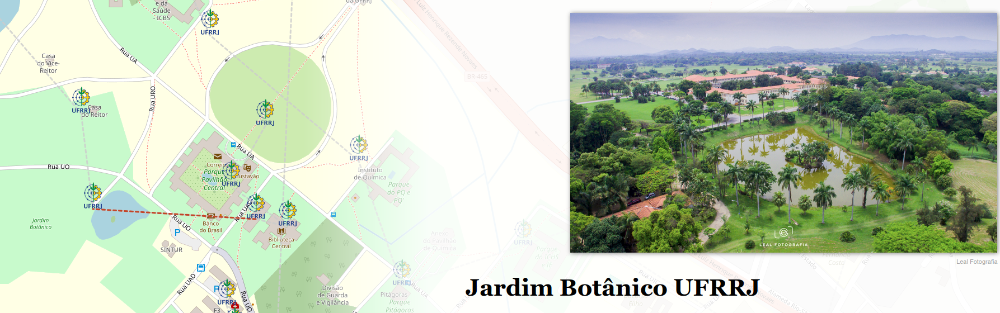
```

Fonte: [Storymap UFRRJ](https://uploads.knightlab.com/storymapjs/900b7a9343559e19eae3c9dffed08d71/ufrrj/draft.html)


# Introdução à Análise Estatística Espacial

## O que é Análise Estatística Espacial ?

- São métodos estatísticos que levam em consideração a localização espacial do fenômeno estudado;

- Segundo Bailey & Gatrell (1995), *"A análise estatística espacial é aplicada quando os dados possuem localização geográfica e quando o arranjo espacial desses dados é considerado relevante para a análise e interpretação dos resultados."*

- A primeira questão a ser considerada é: os dados seguem um padrão aleatório ou indicam a presença de agregações bem definidas (*clusters*) ?

```{r echo=F, fig.align="center", out.width= "80%", fig.show='hold'}
knitr::include_graphics('figuras/Cluster.png')
```

## Origem da Estatística Espacial

O uso de dados espaciais na saúde teve um marco histórico com John Snow, que em 1854 mapeou um surto de cólera em Londres, desafiando a teoria miasmática* ao identificar a contaminação da água como causa da doença. Ao mapear as mortes por cólera no Soho, John Snow identificou um foco ao redor da bomba de água da Broad Street, apoiando sua hipótese de transmissão hídrica.

<span style="font-size: 10px;">
*"Miasmática" refere-se à teoria que defendia que as doenças eram causadas por vapores ou odores nocivos (miasmas) provenientes de matéria orgânica em decomposição, particularmente em áreas úmidas ou com má higiene.
</span>


```{r echo=F, fig.align="center", out.width= "80%", fig.show='hold'}
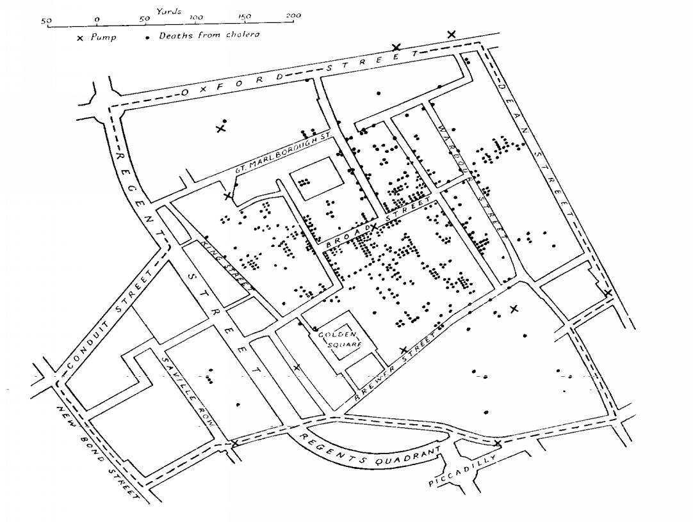
```
<span style="font-size: 11px;">
- Mapeamento dos casos de coléra ($\bullet$) e as bombas de água (X) em Londres, 1854.
</span>

- Dr. John Snow (1813-1858) $\rightarrow$ Considerado pai da Epidemiologia Moderna

```{r echo=F, fig.align="center", out.width= "40%", fig.show='hold'}
include_graphics('figuras/snow_2019.png')
```
\

A imagem mostra homenagens a John Snow em Soho, Londres: um retrato na fachada de um pub, a réplica da bomba de água da Broad Street, e uma placa que marca a descoberta de que a cólera era transmitida pela água contaminada em 1854.

## Objetivos da Estatística Espacial

1) Investigar padrões espaciais e espaço-temporais, por meio de técnicas como a Análise Exploratória de Dados Espaciais (AEDE) e medidas de correlação espacial, visando identificar estruturas, agrupamentos e dependências nos dados geográficos.

2) Modelar fenômenos espaciais utilizando modelos estatísticos apropriados, como regressões espaciais (ex: SAR, CAR, GWR) e modelos espaço-temporais, que permitem controlar efeitos de vizinhança (dependência espacial) e heterogeneidade geográfica, com o objetivo de explicar e/ou prever fenômenos influenciados pela localização geográfico.

## Dependência Espacial ou Autocorrelação Espacial

- Segundo Cressie (1991), embora a suposição de independência entre observações torne a teoria estatística mais tratável, modelos que incorporam *dependência estatística* costumam ser mais realistas, especialmente em contextos espaciais. Nesse tipo de dado, a *dependência entre observações ocorre em múltiplas direções* e tende a diminuir conforme aumenta a distância entre os locais amostrados. Em outras palavras, valores próximos no espaço tendem a ser mais semelhantes entre si do que valores distantes, o que caracteriza a autocorrelação espacial.

- *"Todas as coisas se parecem, porém coisas mais próximas tendem a ser mais semelhantes do que aquelas mais distantes."*  (Tobler, 1979). `r colFmt(" **Também conhecida como $1^a$ Lei da Geografia**",'red')`

## Tipologia dos Dados Espaciais

Os dados espaciais podem ser classificados segundo diferentes categorias, com base na natureza estocástica de suas observações e na forma como a informação geográfica é representada. Essa tipologia orienta a escolha de métodos estatísticos apropriados para análise.

Segundo Noel Cressie (1993), a estatística espacial pode ser dividida em três grandes áreas:

  i) `r colFmt(" **Dados de Processos Pontuais ou Padrões Pontuais**",'darkmagenta')`: As observações ocorrem de maneira aleatória no espaço, como casos de uma doença, localização de crimes ou ocorrência de focos de queimadas. O objetivo é entender padrões de agrupamento, dispersão ou aleatoriedade desses pontos.

  ii) `r colFmt(" **Dados de Geoestatística**",'darkmagenta')`: Refere-se as observações que apresentam um atributo mensuravél em localizações contínuas ou irregulares (por exemplo, temperatura, poluição, altitude, teor de argila). Nesses casos, há interesse na dependência espacial entre valores próximos e na interpolação de valores para locais não amostrados, por meio de métodos como krigagem.

  iii) `r colFmt(" **Dados de Área**",'darkmagenta')`: Representam fenômenos agregados por unidades geográficas, como municípios, distritos ou setores censitários. As análises incluem autocorrelação espacial (ex: I de Moran) e modelos de regressão espacial adaptados a dados agregados.

<!-- Existem métodos estatı́sticos diferentes para descrever ou analisar estes tipos de dados. Exemplo: -->

<!-- ```{r echo=F, fig.align="center", out.width= "75%", fig.show='hold'} -->
<!-- include_graphics('figuras/slide4.jpg') -->

<!-- ``` -->

# Padrões Pontuais

* O principal interesse está no conjunto de coordenadas geográficas representando as localizações exatas de eventos.

```{r echo=F, fig.align="center", message=FALSE, warning=FALSE, comments=NA, out.width="50%", comment=NA}
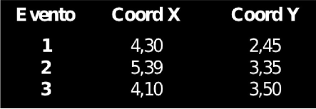
```

## Exemplos de aplicação

::: box-dica3
- 🏥 Localização de casos de uma doença notificados em uma cidade.
- 🌳 Distribuição espacial de árvores em um parque urbano.
- 🐾 Registros de avistamentos de animais silvestres em uma reserva.
- 🔥 Pontos de ocorrência de focos de incêndio florestal detectados por satélite.
:::

::: box-dica2
Neste tipo de dado, o evento aleatório de interesse é a posição espacial onde o fenômeno ocorre, e não uma variável medida em si. A análise busca entender se os pontos seguem um padrão aleatório, agrupado (clusters) ou disperso no espaço.

:::

```{r echo=F, fig.align="center", out.width= "55%", fig.show='hold'}
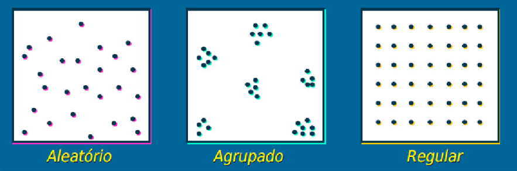
```


```{r echo=F, fig.align="center", message=FALSE, warning=FALSE, comments=NA, out.width="70%", comment=NA}
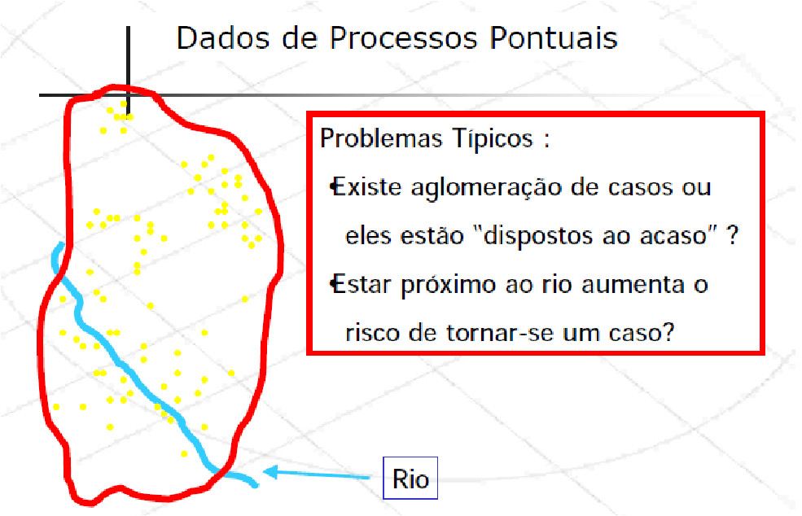
```


## Estimativas de Kernel (ou Mapas de Calor)

As estimativas de densidade kernel são uma técnica amplamente utilizada para **representar visualmente a concentração espacial de eventos pontuais**, como casos de doenças, crimes ou ocorrências de focos de calor. Essa abordagem transforma um conjunto de pontos em uma superfície contínua de intensidade, evidenciando áreas com maior ou menor densidade (nesse caso a frequencia) de eventos.

```{r echo=FALSE, fig.align="center", out.width="60%", fig.cap="Localização da ocorrência de casos de dengue em Belo Horizonte/MG"}
knitr::include_graphics('figuras/dengueBH.png')
```

A técnica foi aplicada para identificar áreas de maior risco de dengue em Belo Horizonte/MG. O mapa resultante revela zonas de alta concentração de casos, o que pode subsidiar ações de controle vetorial e políticas públicas de saúde mais direcionadas.

O objetivo principal é estimar a função de intensidade espacial $\hat{\lambda}_{\tau}(u)$, que descreve a probabilidade de ocorrência de eventos em diferentes locais da região de estudo.


```{r echo=F, fig.align="center", out.width= "45%", fig.show='hold'}
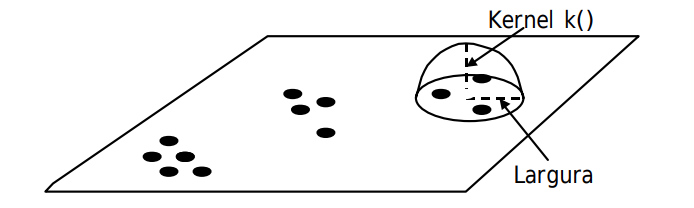
```

* Estimador de intensidade de distribuição de pontos: 

$$\hat{\lambda}_{\tau}(u) = \dfrac{1}{\tau^2}\sum k(\dfrac{d(u_i , u)}{\tau}) \text{   ,   } d(u_i , u) \leq \tau$$

Sabendo que:

- $\hat{\lambda}_{\tau}(u)$: estimativa da intensidade do processo pontual no ponto $u$.
    
- $\tau$: parâmetro de suavização (largura de banda), define o raio de influência dos pontos ao redor de $u$.
    
- $u_i$: coordenadas dos pontos observados no plano (ex.: localização dos eventos).
    
- $d(u_i, u)$: distância entre o ponto observado $u_i$ e o ponto de avaliação $u$. Normalmente, a distância euclidiana.
    
- $k(\cdot)$: função kernel que define o peso atribuído a cada ponto com base na distância. Exemplos:
    
i) *Kernel gaussiano*: atribui maior peso aos pontos mais próximos.
ii) *Kernel uniforme*: todos os pontos dentro do raio recebem o mesmo peso.
iii) *Kernel Epanechnikov*: pesos decrescem com a distância, chegando a zero na borda.

    
- Condição $d(u_i, u) \leq \tau$: garante que apenas os pontos dentro da vizinhança (de raio $\tau$) contribuam para a estimativa.
    
### Como funciona:

- Para cada ponto no espaço, é aplicado um funil de suavização (kernel) que distribui "peso" ao redor do ponto, atribuindo maior peso às áreas próximas e menor peso conforme a distância aumenta.

- Ou seja, esse peso decresce com o aumento da distância a partir do centro, de acordo com uma função $k(\cdot)$, e é controlado por um parâmetro chamado largura de banda ($\tau$).

- O resultado é uma superfície contínua de densidade, onde regiões com cores mais quentes (vermelho, laranja) indicam maior concentração de eventos.

::: box-dica1

🌧️ Analogia intuitiva:

O kernel atua como um limpador de para-brisa, pesando mais os eventos próximos e menos os eventos muito distantes. A escolha do tamanho do limpador ($\tau$) e do tipo de movimento (forma da função kernel) define o quanto você vê ao redor do ponto onde está focando.
:::

```{r echo=F, fig.align="center", out.width= "50%", fig.show='hold'}
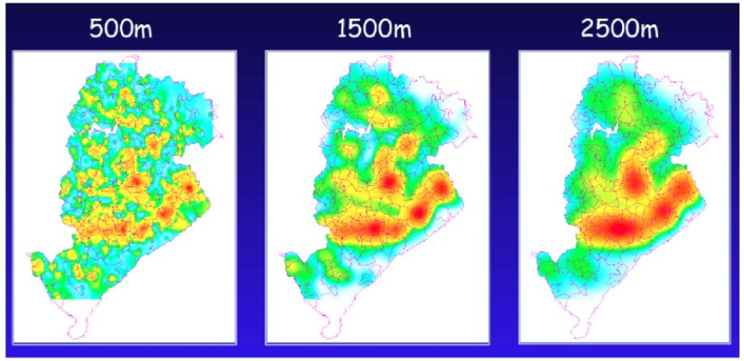
```

A figura acima mostra como diferentes larguras de banda ($500 m$, $1.500 m$ e $2.500 m$) alteram o grau de suavização:

i) Largura pequena ($500 m$): permite detectar agrupamentos muito locais, mas pode introduzir ruídos, ou seja, variações artificiais causadas por flutuações aleatórias nos dados, que não representam padrões reais.

ii) Largura intermediária ($1.500 m$): equilíbrio entre detalhe e suavidade.

Largura maior ($2.500 m$): suaviza padrões locais, ideal para visualizar tendências gerais.


[*Fonte: Referência científica: Druck, S.; Carvalho, M.S.; Câmara, G.; Monteiro, A.V.M. (eds) "Análise Espacial de Dados Geográficos". Brasília, EMBRAPA, 2004](http://www.dpi.inpe.br/gilberto/livro/analise/cap2-eventos.pdf)


# Geoestatística

* Dados usados em geoestatística são atributos contínuos medidos em localizações fixas, na maioria das vezes amostrados no espaço geográfico, e que queremos analisar para entender como um fenômeno varia no espaço.

## Estrutura dos dados geoestatísticos

Imagine que você tem um conjunto de pontos no mapa, e para cada ponto você tem um valor observado. O conjunto de dados geralmente tem:

|   Latitude   |  Longitude   | Atributo Mensurado |
|:-----------:|:------------:|:----------------:|
|   -22.90    |   -43.20     |       5.4        |
|   -22.91    |   -43.22     |       6.1        |
|   -22.92    |   -43.18     |       5.9        |

## Exemplos de aplicação

::: box-dica3
- 🌧️ Medição da quantidade de chuva em diferentes locais de uma cidade.</li>
- 🦟 Contagem de ovos de Aedes aegypti em ovitrampas.</li>
- 🌫️ Concentração de poluentes no ar em pontos georreferenciados.</li>
- 🌽 Análise da produtividade agrícola em diferentes talhões de uma fazenda.</li>

:::


* Umas das aplicações mais importantes da geoestatística é a interpolação de dados, ou seja, estimação de valores em locais onde não há medição.


## Semivariograma: a base da análise espacial

Uma das principais ferramentas da geoestatística é o semivariograma, que mede o quanto dois pontos próximos no espaço se parecem (ou se diferem) com relação ao valor de uma variável.

::: box-dica2
**A ideia central é**: Se dois pontos estão muito próximos, é esperado que seus valores sejam parecidos. Já se estiverem distantes, a diferença entre os valores tende a aumentar.

:::

A versão experimental do semivariograma é calculada para diferentes distâncias entre os pontos, usando a seguinte fórmula:

<!-- * A determinação experimental do semivariograma, para cada valor de $x_i$, considera todos os pares de amostras $z(x)$ e $z(x+h)$, separadas pelo vetor distância $h$, a partir da equação:  -->

<!-- ```{r echo=F, fig.align="center", out.width= "25%", fig.show='hold'} -->
<!-- 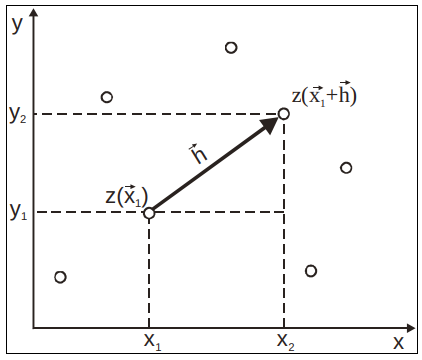 -->
<!-- ``` -->


$$\hat{\gamma}(h) = \dfrac{1}{2N(h)}\sum^{N(h)}_{i=1}[z(x_i) - z(x_i + h)]^2 $$
 Sabendo que:
 
 - $\hat{\gamma}(h)$: valor estimado do fenômeno para a distância $h$;

- $N(h)$: número de pares de pontos separados por uma distância $h$;

- $z(x_i)$: valor observado da variável na localização $x_i$;

- $z(x_i + h)$: valor observado da variável em um ponto a uma distância $h$ de $x_i$.

* A expressão representa a \textbf{diferença média ao quadrado} entre os valores da variável observada em pares de pontos separados pela distância $h$.


<!-- * Sendo $\hat{\gamma}(h)$ o semivariograma estimado e $N(h)$ o número de pares de valores medidos, $z(x)$ e $z(x+h)$, separados pelo vetor $h$.   -->

```{r echo=F, fig.align="center", out.width= "40%", fig.show='hold'}
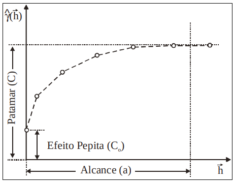
```

::: box-dica1

📌 **Efeito Pepita (C₀)**: É a variação observada mesmo quando a distância entre os pontos é muito pequena ou zero. Costuma representar erros de medição ou variabilidade microscópica não capturada.

📌 **Patamar (C)**: É o valor em que o variograma se estabiliza, indicando que a partir de certa distância, a variabilidade entre os pontos não aumenta mais. Representa a variância total dos dados.

📌 **Alcance (a)**: É a distância a partir da qual dois pontos deixam de estar correlacionados. Até essa distância, os valores ainda apresentam semelhança espacial, ou seja, após essa distância, tornam-se independentes.

:::

Apesar de útil, essa fórmula não é robusta em todas as situações. Em alguns casos, a variabilidade não é constante ao longo da área estudada — o que chamamos de heterocedasticidade. Nesses cenários, modelos diferentes podem ser utilizados para representar o comportamento do semivariograma. Por exemplo:

- Modelo Exponencial

- Modelo Esférico

- Modelo Gaussiano


```{r echo=F, fig.align="center", out.width= "40%", fig.show='hold'}
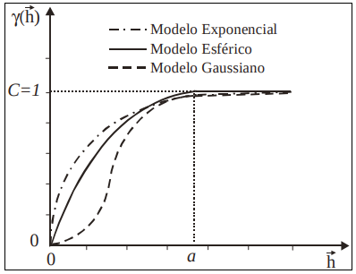
```


* **Exemplo:** Mapa sobre o teor de argila no solo.

```{r echo=F, fig.align="center", out.width= "70%", fig.show='hold'}
knitr::include_graphics('figuras/geoestatistica7.png')
```

A imagem mostra a interpolação do teor de argila em uma área agrícola da Fazenda Canchim (SP), a partir de amostras de solo coletadas em campo. Diversos métodos são comparados: **a geoestatística (krigagem)**, que utiliza a estrutura de dependência espacial dos dados via semivariograma e produz um mapa suavizado e estatisticamente robusto; o método do **inverso da distância (IDW)**, que pondera os pontos mais próximos com maior influência, resultando em maior detalhamento local, mas com risco de exagerar variações; a **média simples**, que suaviza os dados sem considerar plenamente a variabilidade espacial; e o método do **vizinho mais próximo**, que gera áreas abruptas ao atribuir a cada região o valor da amostra mais próxima, sem suavização. O exemplo evidencia como a escolha do método de interpolação impacta diretamente a qualidade e continuidade do mapa final.


[*Fonte: Referência científica: Druck, S.; Carvalho, M.S.; Câmara, G.; Monteiro, A.V.M. (eds) "Análise Espacial de Dados Geográficos". Brasília, EMBRAPA, 2004](http://www.dpi.inpe.br/gilberto/livro/analise/cap3-superficies.pdf)

# Dados de Área

* Na análise espacial por áreas, o atributo de interesse costuma ser uma medida agregada (como contagem de casos, taxa de mortalidade, média de renda, etc.) calculada dentro de uma unidade geográfica bem definidas (como bairros, municípios, setores censitários ou regiões administrativas.)

* Essas áreas são representadas por polígonos, que podem ter formas irregulares e manter relações espaciais com as áreas vizinhas, seja por fronteiras compartilhadas, conexões físicas (como estradas e rios), ou por semelhanças em características socioeconômicas (como nível de renda ou acesso a serviços).

::: box-dica2
O objetivo da análise de dados de área é identificar, explicar e interpretar padrões espaciais e tendências que ocorrem entre essas unidades geográficas pré-definidas.

:::

## Exemplos de aplicação

::: box-dica3

- 🦟 Taxa de incidência de dengue por bairro em uma cidade.
- 💸 Renda per capita por setor censitário.
- 🌽 Produtividade agrícola por microrregião.
- 🏫 Taxa de evasão escolar por município.
- 🚔 Taxa de criminalidade por distrito policial.
- 📦 Volume de vendas por zona de entrega.
:::

## Mapa Temático

* O mapa temático tem como principal objetivo visualizar e analisar a distribuição espacial de um fenômeno específico.

* O mapa temático abaixo mostra a frequência de artigos científicos selecionados na revisão integrativa sobre diagnóstico microbiológico de Salmonella spp. na aquicultura entre 2000 e 2020 por países de diferentes continentes. Fonte: Porto et al. 2023 ([link](https://tede.ufrrj.br/jspui/bitstream/jspui/6673/2/2023%20-%20Yuri%20Duarte%20Porto%20%28parcialmente%20liberada%29.pdf)).

```{r echo=F, fig.align="center", out.width="70%"}
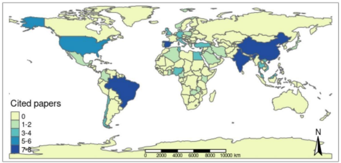
```


## Matriz de Vizinhança

- A **matriz de vizinhança** \( W \) é uma matriz quadrada de dimensão \( n \times n \), onde cada elemento \( w_{ij} \) representa uma **medida de proximidade ou conectividade espacial** entre duas regiões \( O_i \) e \( O_j \).

- Essa matriz é fundamental na análise espacial, pois define **quais áreas são consideradas vizinhas** e como essa vizinhança influencia os fenômenos observados.

```{r echo=F, fig.align="center", out.width="80%"}
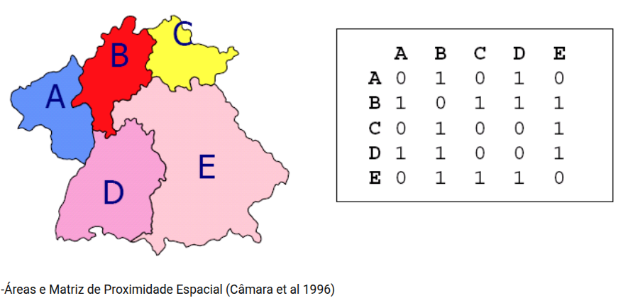
```

- A matriz \( W \) pode ser **binária** (0 ou 1) ou **ponderada**, dependendo do critério adotado.

::: box-dica4

📌 Critérios comuns para definir vizinhança:

- \( w_{ij} = 1 \), se \( O_i \) **toca** \( O_j \) (ou seja, compartilham uma fronteira comum). Esse também é chamado de critério de **contiguidade**.

- \( w_{ij} = 1 \), se a **distância entre os centróides** das regiões \( O_i \) e \( O_j \) for **menor que um limite \( h \)**. Esse é o critério baseado em **distância geográfica**.

- \( w_{ij} = \frac{l_{ij}}{l_i} \), onde:

  - \( l_{ij} \): comprimento da fronteira compartilhada entre \( O_i \) e \( O_j \)
  
  - \( l_i \): perímetro total da região \( O_i \) 
  
  Esse critério expressa a **proporção da fronteira** de \( O_i \) que está em contato com \( O_j \), e é útil para análises mais refinadas de conectividade.

:::


## Moran Global, Moran Local e Lisa Map

### 🧮 Moran Global

* Mede a autocorrelação espacial global, ou seja, se valores semelhantes estão agrupados no espaço.


$$I = \frac{ \sum_{i=1}^{n} \sum_{j=1}^{n} w_{ij} (y_i - \bar{y})(y_j - \bar{y}) }{ \sum_{i=1}^{n} (y_i - \bar{y})^2 }$$

::: box-dica4

* $I > 0$: valores similares estão próximos (agrupamento positivo).

* $I < 0$: valores diferentes estão próximos (dispersão).

* $I \approx 0$: padrão aleatório.

:::

Sabendo que:

- \( I \): valor do índice de Moran global.
- \( n \): número total de unidades espaciais (regiões).
- \( y_i \): valor da variável de interesse na região \( i \).
- \( \bar{y} \): média dos valores de \( y \) em todas as regiões.
- \( w_{ij} \): elemento da matriz de vizinhança que representa a relação espacial entre as regiões \( i \) e \( j \).
  - \( w_{ij} = 1 \) se \( i \) e \( j \) são vizinhos, 0 caso contrário (ou ponderado).
- O numerador mede a covariância espacial ponderada, e o denominador é a variância total de \( y \).

### 🧮 Moran Local (LISA)

* Avalia a autocorrelação espacial **local**, permitindo identificar regiões com agrupamentos (clusters) ou comportamentos atípicos.

$$I^{(i)} = \frac{n}{\sum_{j=1}^{n} (z_j - \bar{z})^2} \sum_{j=1}^{n} w_{ij} (z_i - \bar{z})(z_j - \bar{z})$$

Sabendo que:

- \( I^{(i)} \): índice de Moran local para a região \( i \).
- \( n \): número total de regiões.
- \( z_i \): valor padronizado (ou original, dependendo da convenção) da variável na região \( i \).
- \( \bar{z} \): média da variável \( z \).
- \( w_{ij} \): peso espacial entre as regiões \( i \) e \( j \).
- A soma considera a influência dos vizinhos \( j \) sobre o ponto \( i \), ponderada pela matriz de vizinhança.

::: box-dica2

🗺️ Resumindo

- **Moran Global** indica se há padrão geral de autocorrelação espacial (positivo, negativo ou aleatório).

- **Moran Local** revela **onde** esses padrões ocorrem: clusters de alto/alto (*hotspots*), baixo/baixo (*coldspots*), alto/baixo (*outliers*), etc.

:::
<!-- ```{r echo=F, fig.align="center", out.width="20%", fig.cap="Moran Global"} -->
<!-- 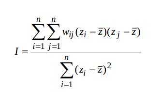 -->
<!-- ``` -->

<!-- ```{r echo=F, fig.align="center", out.width="30%", fig.cap="Moran Local"} -->
<!-- 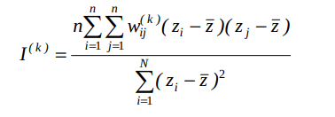 -->
<!-- ``` -->


### 🗺️ LISA Map

O LISA Map é um mapa temático que representa graficamente os resultados do Índice de Moran Local. Ele identifica:

- Clustering local (agrupamento de valores semelhantes)

- Outliers espaciais (valores discrepantes em relação aos vizinhos)

- Regiões não significativas (sem padrão espacial detectável)


| Tipo de Associação        | Descrição                                                | Interpretação Espacial                                                |
| ------------------------- | -------------------------------------------------------- | --------------------------------------------------------------------- |
| 🔴 **Alto-Alto (High-High)** | Valor alto cercado por vizinhos também com valores altos | Indica **cluster de altas magnitudes**, também chamado de **hotspot** |
| 🔵 **Baixo-Baixo (Low-Low)** | Valor baixo cercado por vizinhos com valores baixos      | Indica **cluster de baixas magnitudes**, ou **coldspot**              |
| 🟠 **Alto-Baixo (High-Low)** | Valor alto cercado por valores baixos                    | Indica um **outlier espacial positivo**                               |
| 🟡 **Baixo-Alto (Low-High)** | Valor baixo cercado por valores altos                    | Indica um **outlier espacial negativo**                               |
| ⚪ **Não significativo**     | Sem associação espacial relevante                        | O valor na região não apresenta padrão espacial detectável            |


Os valores do Moran Local são testados por permutação para verificar se o padrão observado é estatisticamente significativo ou poderia ocorrer por acaso.

Apenas as regiões significativas (p-valor < 0.05) costumam ser coloridas nos mapas.

<!-- * Desigualdade no nível distrital na cobertura de saúde reprodutiva, materna, neonatal e infantil na Índia -->

<!-- ```{r echo=F, fig.align="center", out.width="90%"} -->
<!-- 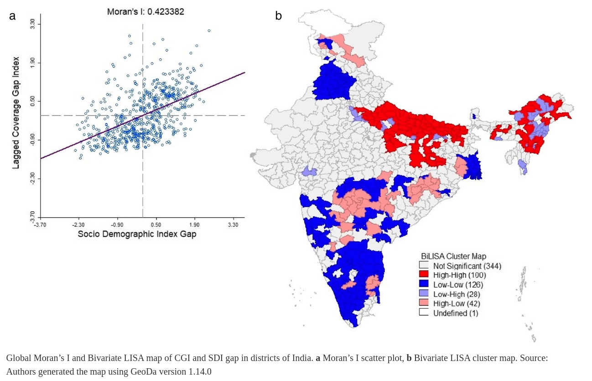 -->
<!-- ``` -->

<!-- [Fonte: PANDA, Basant Kumar; KUMAR, Gulshan; AWASTHI, Ashish. District level inequality in reproductive, maternal, neonatal and child health coverage in India. BMC public health, v. 20, n. 1, p. 1-10, 2020.](https://bmcpublichealth.biomedcentral.com/articles/10.1186/s12889-020-8151-9) -->

Esse mapa abaixo pertence ao artigo ["Are regions equal in adversity? A spatial analysis of the spread and dynamics of COVID-19 in Europe", de Amdaoud, Arcuri e Levratto (2021)](https://www.researchgate.net/publication/349729379_Are_regions_equal_in_adversity_A_spatial_analysis_of_the_spread_and_dynamics_of_COVID-19_in_Europe). O artigo realiza uma análise espacial detalhada da mortalidade por COVID-19 em 125 regiões europeias durante a primeira onda da pandemia (março a maio de 2020). 

```{r echo=F, fig.align="center", out.width="80%"}
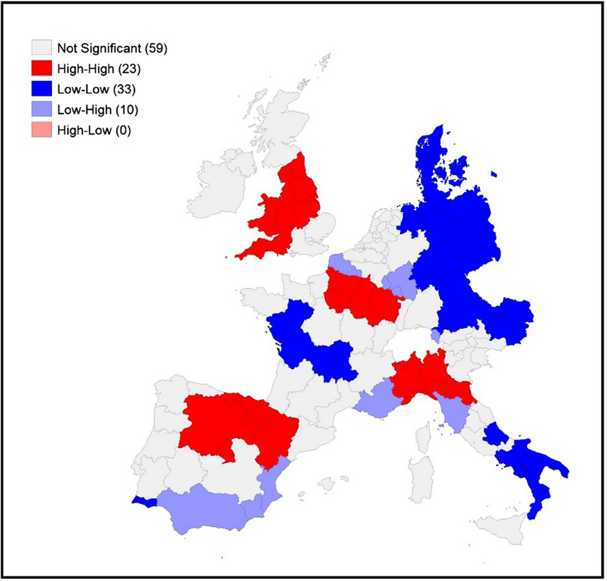
```

Utilizando o índice de Moran Local (LISA), o estudo identifica padrões de autocorrelação espacial na mortalidade por COVID-19 entre as regiões europeias durante a primeira onda da pandemia. O resultado evidencia clusters espaciais significativos, com destaque para regiões High-High (altas taxas de mortalidade cercadas por outras com altas taxas), como o norte da Itália, Madrid e a região da Alsácia, na França. Ao mesmo tempo, regiões Low-Low, como o sul da Itália, Dinamarca e partes da Alemanha Oriental, apresentaram baixa mortalidade em vizinhança igualmente baixa. Esses padrões persistentes ao longo do tempo indicam que a disseminação da pandemia seguiu lógicas regionais, reforçando a importância de políticas públicas que considerem as desigualdades territoriais na resposta à crise sanitária.

## Modelos de Regressão Espacial

### Introdução
Além das análises exploratórias para os dados espaciais de área, é possível avançar na modelagem estatística dos dados por meio de modelos espaciais que consideram a dependência espacial dos dados. Entre os mais utilizados estão os modelos de autocorrelação espacial global, como o **SAR (Simultaneous Autoregressive Model)** e o **CAR (Conditional Autoregressive Model)** (CRESSIE, 1993). O modelo SAR incorpora a dependência espacial diretamente no valor da variável dependente, assumindo que o valor observado em uma região é influenciado pelos valores das regiões vizinhas. Já o modelo CAR considera essa dependência na estrutura do erro, sendo muito utilizado em abordagens bayesianas para modelagem de risco em áreas geográficas.

Outra abordagem é a dos modelos com efeitos espaciais locais, como a **Regressão Geograficamente Ponderada (GWR)** (FOTHERINGHAM et al., 2002). Diferente dos modelos SAR e CAR, que assumem relações espaciais globais, o GWR permite que os coeficientes da regressão variem ao longo do espaço, ajustando uma equação específica para cada localidade. Isso possibilita identificar como os efeitos de uma variável explicativa sobre a resposta mudam de acordo com a localização, sendo especialmente útil em contextos onde há forte heterogeneidade espacial. 

### Na prática

* `r colFmt(" Hipótese de independência das observações em geral é Falsa ",'orange')` $\rightarrow$  Existe dependência espacial, ou seja, o valor observado em uma localização tende a se parecer com os valores observados em locais vizinhos.

* Efeitos Espaciais $\rightarrow$ Se existir dependência ou correlação espacial significativa, devemos incluir no modelo os `r colFmt(" Efeitos Espaciais ",'darkpurple')`, caso contrário, as estimativas geradas pelo modelo de regressão podem ficar enviesadas, criando associações espúrias (isto é, sugerindo relações estatísticas onde elas não existem de fato, ou mascarando relações reais);

* `r colFmt("**Como verificar ?** ",'darkred')` $\rightarrow$ Para detectar a dependência espacial, podemos analisar os resíduos da regressão tradicional (OLS), utilizando indicadores como o índice de Moran dos resíduos. Se os resíduos mostrarem autocorrelação espacial significativa, isso indica que há estrutura espacial não modelada.

* `r colFmt("**Detectada a autocorrelação espacial: e agora ?** ",'darkblue')` $\rightarrow$  É necessário adotar modelos de regressão que incorporem explicitamente os efeitos espaciais, evitando vieses nas estimativas dos coeficientes.


### i) Modelos Globais: 

* Esses modelos assumem que a estrutura espacial é constante em todo o espaço geográfico. Utilizam um único parâmetro para captar a autocorrelação.

* Um exemplo é o **Modelo de Erro Espacial** (*Spatial Error Model* - **CAR**), representado por:
    
$$y_i = \beta_0 + \sum^{p}_{k} \beta_k x_{ik}  + \varepsilon_i \text{    , sendo  }  \varepsilon_i = \lambda  W + \xi$$

::: box-dica4
Sendo:

- $y_i$: valor observado da variável dependente na unidade $i$;

- $\beta_0$: intercepto da regressão;

- $\beta_k$: coeficiente da $k$-ésima variável explicativa;

- $x_{ik}$: valor da $k$-ésima variável explicativa para a unidade $i$;

- $\varepsilon_i$: erro com estrutura de autocorrelação espacial;


- $\lambda$: coeficiente de autocorrelação espacial;

- $W$: matriz de vizinhança espacial (define como cada unidade está conectada às outras);

- $\xi$: erro aleatório normal (sem autocorrelação), com $\mathbb{E}[\xi]()
:::

$\rightarrow$ Podemos observar que os efeitos da autocorrelação espacial são associados ao termo de erro.

::: box-dica2

🧠 Interpretação:

- Se $\lambda \ne 0$, há evidência de dependência espacial nos erros, ou seja, o erro em uma localidade está correlacionado com os erros em localidades vizinhas.

- Se $\lambda = 0$, o modelo reduz-se a uma regressão tradicional, e não há autocorrelação espacial significativa.
:::


### ii) Modelos Locais: 

* Enquanto os modelos globais assumem uma relação espacial uniforme, os modelos locais admitem que os parâmetros da regressão variam ao longo do espaço geográfico.

* Um exemplo clássico é o Modelo **Geograficamente Ponderado** (*Geographically Weighted Regression* - **GWR**), expresso por:
  
    
<!-- $$y_i = \beta_{0}(u_i, v_i) + \sum^{p}_{k}  \beta_k (u_i, v_i) x_{ik} + \varepsilon_i \text{    , sendo  } (u_i, v_i) \text{    as coordenadas geográficas}$$ -->

<!-- Onde: -->

<!-- - $(u_i, v_i)$ representam as \textbf{coordenadas geográficas} da observação $i$; -->
<!-- - Os coeficientes $\beta_k(u_i, v_i)$ são estimados \textbf{localmente}, variando de acordo com a posição no espaço. -->


\[
y_i = \beta_{0}(u_i, v_i) + \sum_{k=1}^{p} \beta_k(u_i, v_i) \cdot x_{ik} + \varepsilon_i,
\\
\quad \text{com } \beta_k(u_i, v_i) \text{ estimado via } 
\sum_{j=1}^{n} K(d_{ij}) \cdot x_{jk}
\]

::: box-dica4

Onde:

- $(u_i, v_i)$: coordenadas geográficas da observação $i$;

- $\beta_k(u_i, v_i)$: coeficiente local da variável explicativa $x_k$, estimado para a posição $i$;

- $K(d_{ij})$: função kernel que atribui um peso à observação $j$ com base na distância $d_{ij}$ entre as localizações $i$ e $j$;
:::


**Efeito da vizinhança no GWR**: No GWR, para estimar os coeficientes de regressão em cada local, utiliza-se um "kernel espacial". O objetivo do kernel é dar mais peso para observações próximas e menos peso para as distantes. A forma e o alcance desse kernel são definidos por um parâmetro chamado largura de banda (*bandwidth*).

```{r echo=F, fig.align="center", out.width= "80%", fig.show='hold'}
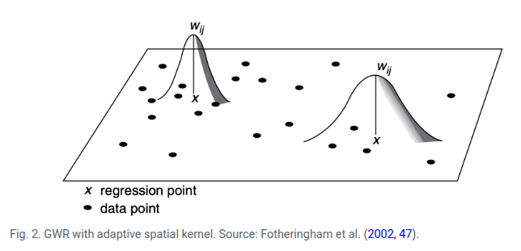
```

$\rightarrow$ Quanto menor $d_{ij}$, maior é o peso de $j$ na estimação de $\beta_k(u_i, v_i)$.

[Fonte: ARDILLY, Pascal et al. Manuel d’analyse spatiale. 2018.](https://ec.europa.eu/eurostat/documents/3859598/9462709/INSEE-ESTAT-SPATIAL-ANA-18-EN.pdf)


<!-- ## Como trabalhar com Análise Estatística Espacial: Algumas ferramentas -->

<!-- ### SiG QGIS -->

<!-- ```{r echo=F, fig.align="center", out.width="80%"} -->
<!--  -->
<!-- ``` -->

<!-- [QGIS: Um Sistema de Informação Geográfica livre e aberto](https://www.qgis.org/pt_BR/site/) -->

<!-- ### GEODA -->

<!-- ```{r echo=F, fig.align="center", out.width="80%"} -->
<!-- 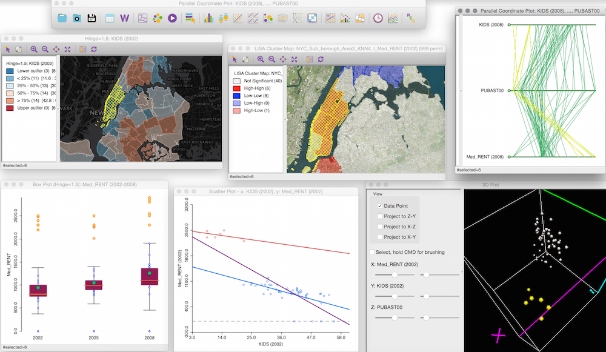 -->
<!-- ``` -->

<!-- [GEODA: AN INTRODUCTION TO SPATIAL DATA ANALYSIS](https://spatial.uchicago.edu/geoda) -->


<!-- ### R -->

<!-- ```{r echo=F, fig.align="center", out.width="60%"} -->
<!--  -->
<!-- ``` -->

<!-- Fonte: [Dicas para integração e instalação do R 4.2 no Ubuntu 22.04 LTS e os pacotes espaciais](https://rtask.thinkr.fr/installation-of-r-4-2-on-ubuntu-22-04-lts-and-tips-for-spatial-packages/) -->


<!-- ### Python -->

<!-- ```{r echo=F, fig.align="center", out.width="60%"} -->
<!--  -->
<!-- ``` -->

<!-- Fonte: [Github Geopandas](https://geopandas.org/en/stable/) -->

<!-- # Serão feitas cinco aplicações da Estatística Espacial utilização o pacote estatístico R: -->

<!-- [Clique aqui para baixar os dados das aplicações](https://drive.google.com/drive/folders/10WMJYlwHcEX9zw3_RUjDQz5DGZByiI2N?usp=sharing) -->

# **Aplicação I:** Utilizando a biblioteca *tmap* para construção rápida de mapas temáticos

```{r, echo=T, out.width='90%'}
library(tmap)

# Carrega dados espaciais do mundo com variáveis socioeconômicas
data(World)

# Define o estilo do mapa (opcional, apenas visual)
tmap_style("classic")

# Cria um mapa temático utilizando a variável esperança de vida
qtm(World, fill = "life_exp", 
    title = "Esperança de Vida por País",
    fill.title = "Anos",
    borders = "gray40")

```

<!-- ## Exercício proposto: -->

<!-- Altere o script para representar outra variável (por exemplo, taxa de alfabetização, população, ou área). O que muda na interpretação do mapa ? Quais países se destacam em cada caso ? -->


# **Aplicação II:** Baixando e construindo mapas a partir da biblioteca *geobr*

### Bibliotecas que serão utilizadas:

```{r, echo=T}
library(ggplot2)
library(dplyr)
library(viridis)
library(geobr)
library(sf)
library(maptools)
library(leaflet)
library(ggspatial)

```

Para acessar os dados dos limites territoriais de todos os estados brasileiros é necessário utilizar a função *read_state*.

```{r, echo=T}
brasil.ufs <- read_state(code_state = "all", year=2019, showProgress = FALSE)
```

### Primeiro, vamos fazer um gráfico apenas com as geometrias.

```{r, echo=T}
ggplot(brasil.ufs) + 
  geom_sf()
```

Para a construção de um mapa onde cada estado recebe uma cor de acordo com a sua região geogrática, procedemos da seguinte forma: 
  
```{r, echo=T,  out.width="90%"}
ggplot(brasil.ufs) + 
  geom_sf(aes(fill = name_region)) + 
  labs(fill="Região")
```

Para plotar o mapa, agora utilizaremos dados relativos ao acesso à rede de esgoto de acordo com a unidade da federação ([fonte dos dados](https://pt.wikipedia.org/wiki/Lista_de_unidades_federativas_do_Brasil_por_acesso_%C3%A0_rede_de_esgoto) ) segundo o censo de 2022. Vamos associar esses dados a tabela de acordo com a variável State e padronizaremos a porcentagem para variar de 0 a 100.


```{r, echo=T,  out.width="90%"}
# Entrando com os dados observados na wikipedia
acesso_esgoto <- data.frame(
  sigla = c("SP", "DF", "RJ", "MG", "ES",
            "PR", "RS", "PE", "GO", "SC",
            "BA", "MS", "RR", "CE", "SE",
            "PB", "AC", "AM", "AL", "TO",
            "MT", "RN", "PI", "PA", "RO",
            "AP", "MA"),
  
  rede_esgoto = c(93.6, 89.9, 88.9, 81.4, 78.2,
                  73.7, 71.0, 65.1, 61.7, 61.4,
                  59.5, 57.2, 56.0, 52.8, 51.0,
                  49.9, 47.7, 47.0, 40.6, 39.8,
                  37.4, 35.8, 26.8, 23.5, 21.7,
                  20.7, 18.1)
)

```


```{r, echo=T,  out.width="90%"}
# Unindo os dados com o shapefile

brasil.ufs <- brasil.ufs %>%
  left_join(acesso_esgoto, by = c("abbrev_state" = "sigla"))


```

<center>

  
```{r, echo=T,  out.width="90%"}
# Construindo o mapa com ggplot
brasil.ufs |>
  ggplot(aes(fill = rede_esgoto), color = "black") + 
  geom_sf() + 
  scale_fill_viridis(name = "Municípios com rede de esgoto (%)", direction = -1) + 
  xlab("Longitude") + ylab("Latitude") + annotation_scale(location = "bl") +
  annotation_north_arrow(location = "br") + 
  theme_minimal()
```

</center>
  
Uma forma alteranativa de apresentar esses mesmos dados se dá pela apresentação de círculos com raios proporcionais a porcentgem de municípios com rede de esgoto no centroide de cada geometria (nesse caso, UF).

```{r, echo=T,  out.width="80%"}
# Calcula o centroide de cada estado no objeto espacial brasil.ufs.
coord_pontos <- brasil.ufs |>  
  st_centroid()
```

<center>

 
```{r, echo=T,  out.width="90%"}
# Construindo o mapa com ggplot
ggplot(brasil.ufs) + 
  geom_sf() + 
  geom_sf(data = coord_pontos, aes(size = rede_esgoto), col = "blue", 
          alpha = .65, show.legend = "point") +
    scale_size_continuous(name = "Municípios com rede de esgoto (%)") + 
    xlab("Longitude") + 
    ylab("Latitude") +
    annotation_scale(location = "bl") +
    annotation_north_arrow(location = "br") +
  theme_minimal()
```


</center>


Uma alternativa interativa para trabalhar com mapas é com a utilização do pacote *leaflet*
  
<center>

```{r, echo=T,  out.width="70%"}
leaflet(coord_pontos) |>
  # Camada tradicional com nomes e divisões políticas
  addProviderTiles(providers$OpenStreetMap, group = "Mapa Político") |>
  # Camada de imagem de satélite
  addProviderTiles(providers$Esri.WorldImagery, group = "Satélite") |>
  # Adiciona os círculos nos centroides
  addCircleMarkers(
    label = ~ paste0(abbrev_state, ": ", rede_esgoto, "%"), # Rótulo exibido ao passar o mouse
    labelOptions = labelOptions(textsize = "13px"), # Tamanho da fonte do rótulo
    radius = ~ rede_esgoto / 10,              # Raio do círculo proporcional
    fillOpacity = 0.5,                       # Transparência dos círculos
    group = "Dados"
  ) |>
  # Adiciona controle para alternar entre as camadas de fundo
  addLayersControl(
    baseGroups = c("Mapa Político", "Satélite"),
    overlayGroups = "Dados",
    options = layersControlOptions(collapsed = FALSE)
  )

```  
  
</center>
  
---

# **Aplicação III:** Dengue em Dourados/MS - Parte 1: Análise exploratória

* Nesta apresentação, serão utilizados dados com ruído espacial, com o objetivo de preservar a confidencialidade das informações originais. Esses dados fazem parte da dissertação de [Isis Rodrigues Reitman](https://sucupira.capes.gov.br/sucupira/public/consultas/coleta/trabalhoConclusao/viewTrabalhoConclusao.jsf?popup=true&id_trabalho=3666174), intitulada *“Saúde e Ambiente Urbano: a relação de incidência de dengue e as disparidades espaciais em Dourados – MS”*, apresentada em abril de 2016 no [Programa de Pós-Graduação em Geografia da Universidade Federal da Grande Dourados (UFGD)](https://portal.ufgd.edu.br/pos-graduacao/mestrado-doutorado-geografia/index).

* Os ruídos nas coordenadas foram gerados a partir de uma distribuição uniforme. A função produz valores aleatórios entre -15 e 15 para cada linha do conjunto de dados. Esse procedimento simula um deslocamento máximo de até 15 metros em cada direção, o que é suficiente para preservar o padrão espacial geral dos casos, ao mesmo tempo em que evita a identificação precisa das localizações originais.

```{r, eval=FALSE, echo = TRUE}
# Supondo que seu dataframe se chame `casos`
# Adicionando um ruído aleatório pequeno (por exemplo, até ±15 metros) às coordenadas X e Y

set.seed(123)  # Para reprodutibilidade
casos$X_ruido <- casos$X + runif(nrow(casos), -15, 15)
casos$Y_ruido <- casos$Y + runif(nrow(casos), -15, 15)
```


* Essa aplicação também se encontra no [Curso de Estudos Ecológicos](https://ogcruz.github.io/) ministrado para o curso de [Pós-Graduação em Epidemiologia em Saúde Pública](http://ensino.ensp.fiocruz.br/cursos/mestrado-e-doutorado/epidemiologia-em-saude-publica) em 2019, pelos pesquisadores [Oswaldo Gonçalves Cruz (PROCC/FIOCRUZ)](https://lsbastos.github.io/PROCC/membro-9530671289607786.html) e [Wagner Tassinari (DEMAT/ICE/UFRRJ)](https://institucional.ufrrj.br/ruralpesquisa/wagner-de-souza-tassinari/)

 **OBS:** Os dados e as malhas geográficas utilizadas nessa apresentação, estão disponíveis no seguinte endereço: ([link](https://github.com/wtassinari/Estatistica_Espacial/tree/main/dados))


### Biliotecas do R que serão utilizadas

```{r, echo=T}

library(readr)
library(tidyverse)
library(sf)
library(maptools)
library(spatstat)
library(tmap)
```

#### Lendo a tabela da população por setor censitário e os *shapes files* do contorno e por setor censitário de Dourados/MS

```{r, echo=T}

pop2010 <- read_csv('dados/dengue_dourados/pop2010.csv')
setor.sf <- read_sf('dados/dengue_dourados/Setor_UTM_SIRGAS.shp', crs = 31981)
contorno.sf <- read_sf('dados/dengue_dourados/contorno.shp', crs = 31981)

```

📌 O que é CRS (Coordinate Reference System) ?

O CRS é como uma “regra de tradução” entre o que está em um mapa e o mundo real. Ele define como as coordenadas (como 140, 12) se relacionam com locais verdadeiros na Terra, dizendo se os valores estão em metros, graus ou outra unidade, e onde fica o ponto de partida (a origem). Sem um CRS, uma coordenada não tem significado, pois não sabemos onde ela realmente está nem em que escala.

🗺️ Por que isso é importante ?

Se dois mapas tiverem CRSs diferentes, os pontos não vão se alinhar corretamente — como tentar juntar peças de quebra-cabeça de caixas diferentes. Usar o CRS certo garante que todas as informações espaciais estejam bem posicionadas e coerentes. Por exemplo, o WGS 84 é usado por GPS e Google Maps (em graus), enquanto o UTM é usado para mapas locais mais precisos (em metros). Saber isso evita erros em análises espaciais e garante que os dados “conversem” entre si.

**OBS:** Se quiser saber um pouco mais a respeito do CRS, basta acessar ([link](https://rspatial.org/raster/spatial/6-crs.html))


### Fazendo um join com as tabelas com os setores censitários + população

```{r, echo=T}
setor.sf <- setor.sf |> mutate (idsetor = as.numeric(CD_GEOCODI)) |> inner_join(pop2010, by='idsetor')
```

### Lendo e plotando os casos de dengue georreferenciados em Dourados/MS

```{r, echo=T}
casos <- read_csv('dados/dengue_dourados/dengue_dourados.csv')
casos.sf <- st_as_sf(casos, coords = c("X", "Y"), crs = 31981) 
```

```{r, echo=T, out.width="60%"}
ggplot(setor.sf) + 
  geom_sf(fill = 'white', color='black') +
  geom_sf(data=casos.sf, color='red',size=1) +
  theme_void()
```

### Lendo e plotando os os pontos de coleta de lixo georreferenciados em Dourados/MS

```{r, echo=T}
lixo <- read_csv2('dados/dengue_dourados/lixo_dourados.csv')
lixo.sf <- st_as_sf(lixo, coords = c("X", "Y"), crs = 31981)
```

```{r, echo=T,  out.width="70%"}
ggplot(setor.sf) + 
  geom_sf(fill = 'white', color = 'black') +
  geom_sf(data=lixo.sf,color='blue',size=1) +
  theme_void()
```

* Como podemos observar, existem alguns pontos de coleta de lixo fora do contorno de Dourados/MS

### Uma forma de ficarmos só com os pontos dentro do polígono é utilizando o comando `st_intersection`.


```{r, echo=T}
lixo2.sf <- st_intersection(contorno.sf, lixo.sf)
```

```{r, echo=T,  out.width="70%"}
ggplot(setor.sf) + 
  geom_sf(fill = 'white', color = 'black') +
  geom_sf(data=lixo2.sf,color='blue',size=1) +
  theme_void()
```

### Utilizando as informações dos casos (pontos) + do lixo (ponto) + população de cada setor censitário (mapa temático)

```{r, echo=T,  out.width="70%"}
# Adiciona categorias para legenda
lixo$tipo <- "Lixo"
casos.sf$tipo <- "Caso"

ggplot(setor.sf) + 
  geom_sf(aes(fill=pop)) + 
  geom_sf(data = casos.sf, color='red',size = 0.7, aes(colour = "Caso"), 
          show.legend = "point") +
  geom_sf(data = lixo2.sf, color = 'salmon', size = 1, aes(colour = "Lixo"), 
          show.legend = "point") +
  scale_fill_distiller(palette = "PuBu", direction = 1) +
  scale_colour_manual(values = c("Caso" = "red", "Lixo" = "salmon")) +
  theme_minimal()
```
### Construindo os buffers

* Serão construídos buffers com raio de 500 metros ao redor de cada ponto de coleta de lixo. Essa abordagem permite analisar se os casos de dengue ocorrem dentro desse perímetro, ou seja, a até 500 metros dos pontos de coleta. O objetivo é investigar se existe uma relação entre a proximidade desses locais e a ocorrência de casos de dengue.

**Buffers:** São polígonos que contornam um objeto a uma determinada distância. Sua principal função é materializar os conceitos de “perto” e “longe”.

```{r, echo=T,  out.width="70%"}
lixo_buffer <- st_buffer(lixo2.sf, 500) 

# Adiciona categorias para legenda
lixo_buffer$tipo <- "Lixo"
casos.sf$tipo <- "Caso"

ggplot(setor.sf) + 
  geom_sf(aes(fill = pop)) + 
  geom_sf(data = lixo_buffer, aes(color = tipo), fill = "transparent", size = 0.4) +
  geom_sf(data = casos.sf, aes(color = tipo), size = 0.7) +
  scale_fill_distiller(palette = "PuBu", direction = 1) +
  scale_color_manual(values = c("Caso" = "red", "Lixo" = "gray")) +
  theme_minimal()

```

### Representando os casos e o lixo de forma interativa com o a biblioteca `tmap`

```{r, echo=T,  out.width="90%"}
library(tmap)


tmap_mode("view") # modo interativo (Leaflet)
# tmap_mode("plot") # modo estático (p/ publicação)

# Constrói o mapa
tm_shape(setor.sf) + tm_borders("black") +
  tm_shape(casos.sf) + tm_dots(col = "red", palette = "red") +
  tm_shape(lixo.sf) + tm_dots(col = "green", palette = "green") +
  tm_shape(lixo_buffer) + tm_borders(col = "blue")

```

### Convertendo o dado de pontos (padrão pontual) para dados de área

```{r, echo=T}
library(sf)
library(dplyr)

# Conta casos confirmados (CLASSI_FIN == 1) por setor
casos <- casos.sf |>
  filter(CLASSI_FIN == 1) |>        # Filtra apenas casos confirmados
  mutate(contador = 1) |>          # Adiciona coluna de contagem
  st_join(setor.sf, join = st_within) |>  # Une os casos aos setores (dentro do polígono)
  group_by(ID) |>                 # Agrupa por ID do setor
  summarise(casos = sum(contador, na.rm = TRUE)) |> # Conta casos por setor
  st_drop_geometry()  ## remove atributos de geometria


# Número de depósitos de lixo por setor (sem geometria)
lixo <- lixo.sf |>
  mutate(contador = 1) |>                      # Adiciona coluna de contagem
  st_join(setor.sf, join = st_within) |>       # Junta pontos aos setores onde estão contidos
  group_by(ID) |>                              # Agrupa por setor
  summarise(lixo = sum(contador, na.rm = TRUE)) |>  # Soma os depósitos por setor
  st_drop_geometry()                           # Remove geometria


# Inserindo as contagens de lixo e casos confirmados na geometria dos setores
setor.sf <- setor.sf |>
  left_join(lixo, by = "ID") |>    # Junta a contagem de depósitos de lixo por setor
  left_join(casos, by = "ID")      # Junta a contagem de casos confirmados por setor

```


### Plotando o mapa temático dos casos por setor censitário

```{r, echo=T,  out.width="70%"}
plot(setor.sf['casos'])
```

### Plotando o mapa temático dos pontos de coleta de lixo por setor censitário

```{r, echo=T,  out.width="70%"}
plot(setor.sf['lixo'])
```

### Calculando a taxa de incidência e plotando o mapa temático dos pontos de coleta de lixo por setor censitário

```{r, echo=T,  out.width="70%"}
setor.sf$tx <- (setor.sf$casos/setor.sf$pop) * 1000
setor.sf$tx[is.na(setor.sf$tx)] <- 0 # Transformando os missings em zero

summary(setor.sf$tx)
```

### Plotando a distribuição da incidência em Dourados/MS

```{r, echo=T,  out.width="70%"}
library(wesanderson)
pal <- wes_palette("Moonrise3", 20, type = "continuous")

ggplot(setor.sf) + 
  geom_sf(aes(fill = tx), color = 'black') +
  scale_fill_gradientn(colours = pal) +
  ggtitle("Taxa de incidência de Dengue") + 
  theme_void()
```

### Kernel por atributos

- Vamos plotar o kernel por atributos referente a taxa de incidência de dengue em Dourados/MS.

- Primeiramente é necessário dissolver os polígonos em formato sf para obter o contorno. Nesse caso queremos preservar o atributo AREA

```{r, echo=T,  out.width="70%"}
dourados.contorno <- st_union(setor.sf)
plot(dourados.contorno)
```
- Agora iremos converter o contorno geográfico da cidade de Dourados (um polígono `sf`) para o formato `owin `da classe `spatstat`, que é usado para análise espacial de padrões de pontos.

```{r, echo=T,  out.width="70%"}
dourados.w <- as.owin(st_geometry(dourados.contorno))
```

#### Extraindo os centróides dos polígonos em Dourados/MS

```{r, echo=T,  out.width="70%"}
centroides <- st_centroid(st_geometry(setor.sf))

# Transformando em os centróides em formato sp (spatstat)
centroides.sp <- as.data.frame(as_Spatial(centroides))
names(centroides.sp) <- c('X','Y')

plot(centroides.sp)
```

### Colocando os pontos no formato sp

```{r, echo=T,  out.width="70%"}
centroides.ppp <- ppp(centroides.sp$X,centroides.sp$Y, dourados.w)

plot(centroides.ppp,pch=19,cex=0.5)
```

### Construindo o kernel por atributo da taxa de detecção

```{r, echo=T,  out.width="70%"}
kernel.tx <- density(centroides.ppp, 500, weights = setor.sf$tx, scalekernel = TRUE)
plot(kernel.tx)
```

::: box-dica2

- `centroides.ppp`:	Objeto do tipo ppp com os pontos centrais (centroides) dos setores.
500	Largura de banda (bandwidth), ou seja, o alcance de suavização da função kernel, neste caso 500 metros (ou unidades do sistema).

- `weights = setor.sf$tx`: Peso de cada ponto (setor), neste caso uma variável chamada tx, que provavelmente representa uma taxa (ex: incidência por população).

- `scalekernel = TRUE`:	Faz a função kernel se ajustar automaticamente à soma total dos pesos, preservando a escala da densidade ponderada.
:::

### Construindo a matriz de vizinhança para verificar a autocorrelação espacial

```{r, echo=T,  out.width="70%"}
library(spdep)
viz <- poly2nb(setor.sf)
viz 
```

::: box-dica2

- `setor.sf` é um objeto do tipo sf com polígonos (setores).

- `poly2nb()` (polygon to neighbors) calcula quais polígonos são vizinhos, ou seja, compartilham ao menos um lado ou ponto de fronteira (por padrão).

- `viz` é um objeto do tipo nb ("neighbors list") — uma lista onde cada item contém os índices dos setores vizinhos ao setor correspondente.

:::

* Iremos precisar da coordenadas dos centróides para montar a malha de conectividade.

```{r, echo=T,  out.width="70%"}
setor.sp <- as(setor.sf, 'Spatial') # convertendo em formato sp
coord <- coordinates(setor.sp) # coordenadas dos centroidas dos poligonos de dourados
class(setor.sp)
```

### Verificando a malha de conectividade da vizinhança de Dourados/MS

```{r, echo=T}
viz.sf <- as(nb2lines(viz, coords = coord), 'sf')
viz.sf <- st_set_crs(viz.sf, st_crs(setor.sf))
```

::: box-dica2
- `st_set_crs()` define o sistema de referência de coordenadas (CRS) do objeto `viz.sf`.

- Ele está copiando o CRS do objeto `setor.sf`, garantindo que os dois objetos estejam no mesmo sistema de coordenadas.
:::

```{r, echo=T,  out.width="70%"}
# Plotando o grafo de conectividade por contiguidade
mapa.viz <- ggplot(setor.sf) + 
  geom_sf(fill = 'lightpink', color = 'white') +
  geom_sf(data = viz.sf) +
  theme_minimal() +
  ggtitle("Vizinhança por \n conectividade") +
  ylab("Latitude") +
  xlab("Longitude")
mapa.viz
```

### Obtendo a correlação da taxa de incidência de dengue Dourados/MS

- Convertendo a estrutura criada por `poly2nb(setor.sf)` um formato que funções como `moran.test`.

```{r, echo=T}
pesos.viz <- nb2listw(viz)
moran.test(setor.sf$tx, pesos.viz)
```

Podemos observar que existe uma forte autocorrelação espacial positiva na variável `tx`, ou seja, valores semelhantes estão espacialmente agrupados. Em outras palavras, setores com valores altos de `tx` tendem a estar próximos de outros setores com valores igualmente altos (e o mesmo vale para valores baixos). Esse padrão não é aleatório, já que o p-valor é muito pequeno, rejeitando a hipótese nula de ausência de autocorrelação espacial.

### Plotando o correlograma

- O correlograma espacial de *Moran’s I* que você gerou está te mostrando como a autocorrelação espacial da variável `tx` varia conforme o "distanciamento" espacial entre os setores.

```{r, echo=T}
correl <- sp.correlogram(viz, setor.sf$tx, order = 8, method = "I")
correl
```

-A tabela consiste:

  i) `estimate`: o valor observado de Moran’s I.

  ii) `expectation`: valor esperado sob aleatoriedade (≈ 0).

  iii) `Pr(I)`: p-valor de significância para cada lag.


```{r, echo=T,  out.width="80%"}
plot(correl)
```


- Nesse gráfico podemos observar:

  i) O eixo y mostra o valor de Moran’s I para cada lag.

  ii) As barras de erro indicam o intervalo de confiança do Moran’s I em cada lag.

- Podemos compluir então que:

  * Lag 1 (vizinhos imediatos): Moran’s I = 0.5367, altamente significativo (*p < 0.001*) $\rightarrow$ forte autocorrelação espacial positiva.

  * Lags 2 e 3: valores positivos e ainda significativos $\rightarrow$ padrão espacial persiste até o terceiro nível de vizinhança.

  * Lags 4 a 8: valores negativos ou próximos de zero, com significância decrescente ou ausência de significância $\rightarrow$ a autocorrelação desaparece ou se inverte à medida que a distância aumenta.

### Mapeando os polígonos que tiveram os p-valores mais significativos no Moran Local.

```{r, echo=T,  out.width="70%"}
setor.sf$pval <- localmoran(setor.sf$tx, pesos.viz)[,5]

tm_shape(setor.sf) + 
  tm_polygons(
    col = "pval",
    title = "p-valores",
    breaks = c(0, 0.01, 0.05, 0.10, 1),
    style = "fixed",
    palette = "-Oranges",
    border.col = "grey"
  )

```

### Moran Local (Lisa Map) da taxa de incidência Dourados/MS

```{r, echo=T}
resI <- localmoran.sad(lm(setor.sf$tx ~ 1), 1:length(viz), viz, style = "W")
summary(resI)[1:10,]
```

::: box-dica2 

- A função `localmoran.sad()` calcula o Moran Local `(Iᵢ)` e algumas outras estatísticas associadas para cada polígono (setor).

- `lm(setor.sf$tx ~ 1)`:  cria um modelo linear sem preditores (apenas o intercepto), ou seja, considera a variável `tx` como resposta a ser analisada.

- `1:length(viz)`: identifica o índice de cada área/setor.

- `viz`: é a estrutura de vizinhança (do tipo `nb`), que define quem é vizinho de quem.

- `style = "W"`: define o estilo de normalização dos pesos espaciais (padronização row-standardized).

:::

- A está mostrando:

  * `Local Morans I`:	Valor do I de Moran local `(Iᵢ)`, indicando se o valor do setor e seus vizinhos são semelhantes (positivo) ou diferentes (negativo).
  
  * `Stand. dev. (N)`:	Desvio padrão padronizado da estatística de Moran local.
  
  * `Pr. (N)`:	p-valor do teste de significância para o valor de `Iᵢ` (baseado na dist. normal).
  
  * `Saddlepoint`:	Valor do I de Moran local corrigido.
  
```{r, echo=T,  out.width="70%"}
setor.sf$MoranLocal <- summary(resI)[,1] 

library(scales)

ggplot(setor.sf) + 
  geom_sf(aes(fill = MoranLocal), color = 'black') +
  scale_fill_gradientn(colours=c("blue", "white", "red"), 
                       values=rescale(c(min(setor.sf$MoranLocal), 0,   max(setor.sf$MoranLocal))), guide="colorbar") + 
  ggtitle("Moran local") + 
  theme_void()
```


Neste mapa, podemos observar:

- Valores altos de Local Morans I com p-valor pequeno indicam clusters estatisticamente significativos:

  * Positivo + significativo $\rightarrow$ cluster alto-alto ou baixo-baixo.

  * Negativo + significativo $\rightarrow$ outlier (ex: um valor alto cercado por baixos, ou o contrário).

### LISA Map

  
```{r, echo=T}
library(spdep)

#  Convertendo uma estrutura de vizinhança (objeto nb) em uma matriz de pesos espaciais padronizada
w <- nb2listw(viz, style = "W")

# Matriz de pesos espaciais padronizada (row-standardized)
resI <- localmoran(setor.sf$tx, nb2listw(viz, style = "W"))

# Armazena estatísticas no objeto espacial
setor.sf$Ii       <- resI[,1]   # valor de Moran Local
setor.sf$pvalue   <- resI[,5]   # p-valor

# Valor padronizado da variável tx
setor.sf$z_tx <- scale(setor.sf$tx)[, 1]

# Média dos vizinhos (lagged value)
lag_tx <- lag.listw(w, setor.sf$z_tx)

# Classificação dos tipos de associação local dos clusters
setor.sf$cluster_type <- "Não significativo"

setor.sf$cluster_type[setor.sf$pvalue <= 0.05 & setor.sf$z_tx > 0 & lag_tx > 0] <- "Alto-Alto"
setor.sf$cluster_type[setor.sf$pvalue <= 0.05 & setor.sf$z_tx < 0 & lag_tx < 0] <- "Baixo-Baixo"
setor.sf$cluster_type[setor.sf$pvalue <= 0.05 & setor.sf$z_tx > 0 & lag_tx < 0] <- "Alto-Baixo"
setor.sf$cluster_type[setor.sf$pvalue <= 0.05 & setor.sf$z_tx < 0 & lag_tx > 0] <- "Baixo-Alto"


```
  
```{r, echo=T,  out.width="80%"}
library(tmap)

# Modo estático (ideal para relatórios impressos ou PDF)
tmap_mode("plot")

# Tema visual limpo com fundo branco
tmap_style("white")

# Geração do mapa LISA
tm_shape(setor.sf) +
  tm_fill(
    col = "cluster_type",
    palette = c(
      "Alto-Alto"         = "#E60000",  # vermelho forte
      "Baixo-Baixo"       = "#0033CC",  # azul escuro
      "Baixo-Alto"        = "#9999FF",  # azul claro
      "Alto-Baixo"        = "#FF9999",  # rosa claro
      "Não significativo" = "#FFFFFF"   # branco
    ),
    title = "Cluster Local (LISA)",
    legend.is.portrait = TRUE
  ) +
  tm_borders(col = "gray40", lwd = 0.4) +
  tm_layout(
    main.title = "Mapa LISA - Clusters Locais da Taxa de Incidência",
    main.title.size = 1.2,
    legend.outside = TRUE,
    frame = FALSE,
    bg.color = "white"
  )

```
  
# **Aplicação IV:** Dengue em Dourados/MS - Parte 2: Modelagem (Modelos Linear, CAR e GWR)


### Ajustando o modelo de regressão linear simples.

```{r, echo=T,  out.width="70%"}
# Transformando os missings em zero
setor.sf$lixo[is.na(setor.sf$lixo)] <- 0  

# Ajustando o modelo de regressão linear simples
dourados.lm <- lm(tx ~ lixo, data = setor.sf)
summary(dourados.lm)
```

### Checando os residuos para verificar a presença de autocorrelação.

```{r, echo=T,  out.width="70%"}
dourados.lm$lmresid <- residuals(dourados.lm)
moran.test(dourados.lm$lmresid, pesos.viz)
```

### Ajustando o modelo CAR (Spatial Error Model)

O **Modelo de Erro Espacial** (*Spatial Error Model* - **CAR**), representado por:
    
$$y_i = \beta_0 + \sum^{p}_{k} \beta_k x_{ik}  + \varepsilon_i$$
$$\varepsilon_i = \lambda  W + \xi$$

```{r, echo=T,  out.width="70%"}
library(spatialreg)
dourados.car <- errorsarlm(tx ~ lixo, data = setor.sf, listw = pesos.viz)
summary(dourados.car)
```

::: box-dica1

* Lambda ($λ = 0.816$) é o parâmetro de autocorrelação espacial dos erros. Se Um valor de lambda fosse próximo de 0, pouca ou nenhuma autocorrelação espacial nos erros, ou seja, modelo linear tradicional pode ser suficiente.

* Testes (*LR, z, Wald*) mostram que esse parâmetro é altamente significativo ($p-value < 2.22e-16$), ou seja, há autocorrelação espacial nos resíduos, justificando o uso de um modelo espacial ao invés de um modelo clássico.

* A variância residual estimada é de 23.437.

* O modelo espacial tem AIC menor que o modelo clássico (lm):
AIC spatial $=$ 1756.5 $<$ AIC lm $=$ 1931.1, o que indica que o modelo com erro espacial se ajusta melhor aos dados.

:::

- A variável explicativa lixo não foi estatisticamente significativa neste modelo.

- Há forte evidência de autocorrelação espacial nos erros, o que valida a escolha por um modelo do tipo `errorsarlm`.

- O modelo espacial se ajusta melhor do que o modelo tradicional (lm), segundo o critério AIC.

### Checando os residuos para verificar a presença de autocorrelação

```{r, echo=T,  out.width="70%"}
dourados.car$carresid <- residuals(dourados.car)
moran.test(dourados.car$carresid, pesos.viz)
```

Como o $p-valor = 0.2531 > 0.05$, não rejeitamos a hipótese nula de ausência de autocorrelação espacial nos resíduos. Isso indica que o modelo `errorsarlm` eliminou adequadamente a autocorrelação espacial presente nos dados. 

Esse é exatamente o objetivo do modelo `errorsarlm`, capturar a estrutura espacial nos erros. E a ausência de autocorrelação nos resíduos valida a adequação desse modelo para os seus dados.


### Ajustando o modelo GWR (Geographically Weighted Regression)

```{r, echo=T,  out.width="70%"}
# Biblioteca para ajustar o modelos GWR
library(spgwr)

# Estimando a largura de banda “ideal” para o kernel
GWRbanda <- gwr.sel(tx ~ lixo, data = setor.sf, coords = cbind(centroides.sp$X, centroides.sp$Y), adapt = T)
```

::: box-dica2

- Carregando o pacote `spgwr`, que é usado para rodar regressões ponderadas geograficamente (GWR). Essa técnica permite que os coeficientes variem no espaço, ou seja, ela mostra como o efeito de uma variável muda de lugar para lugar.

- `gwr.sel()` é uma função que ajuda a escolher a largura de banda (bandwidth) "ideal" para o modelo GWR. A largura de banda controla o raio de influência espacial ao redor de cada ponto (quais vizinhos têm mais peso).

  * Quanto menor a banda $rightarrow$ modelo mais local (mais sensível ao espaço).

  * Quanto maior $rightarrow$ modelo mais global (menos sensível ao espaço).

**OBS:** Esse valor de `q` representa a proporção de vizinhos usada para construir o kernel. Depois, ao ajustar o modelo com a função `gwr()`, será calculada internamente a distância física real correspondente em metros para cada ponto com base nas coordenadas UTM.  
:::

```{r, echo=T,  out.width="70%"}
# Ajustando o modelo GWR
dourados.gwr = gwr(tx ~ lixo, data = setor.sf, coords = cbind(centroides.sp$X, centroides.sp$Y), adapt = GWRbanda, hatmatrix = TRUE, se.fit = TRUE)

dourados.gwr
```

::: box-dica2

- `coords = cbind(X, Y)`:	Coordenadas dos pontos onde será ajustado o modelo (em nosso caso são os centroides dos setores).

- `adapt = GWRbanda`:	Usando a largura de banda adaptativa "ideal" já estimada (GWRbanda), que define o raio de influência espacial.

- `hatmatrix = TRUE`:	Retorna a matriz com estimativas usadas para cálculos como AIC e diagnóstico de resíduos.

- `se.fit = TRUE`:	Calcula os erros padrão das estimativas locais dos coeficientes.

:::

Esse modelo permite analisar como o efeito da variável `lixo` sobre `tx` muda de um local para outro. Em vez de um único coeficiente como na regressão tradicional, o GWR estima um coeficiente diferente para cada setor do mapa.


::: box-dica1

* `Kernel function: gwr.Gauss` → O modelo usou um kernel gaussiano, que atribui mais peso a vizinhos próximos.

* `Adaptive quantile: 0.005127099` → Como `adapt = TRUE`, a largura de banda representa uma proporção dos pontos vizinhos.

- Quanto aos coeficientes do modelo, cada linha refere-se à distribuição dos coeficientes locais estimados em cada ponto do espaço (284 no total). 

  * Por exemplo, o impacto da variável `lixo` sobre `tx` varia bastante no espaço. Em alguns lugares pode ser fortemente negativo ($-20.43$), em outros levemente positivo ($+1.57$).
  
  * A coluna `Global` mostra o coeficiente que seria obtido numa regressão tradicional (OLS).
  
- `Sigma (residual)`:	Desvio padrão dos resíduos do modelo GWR.

- `AIC (GWR)`: 	Critério de informação de Akaike (quanto menor, melhor). Útil para comparar com OLS.

- `AICc (corrigido)`: Versão do AIC corrigida para modelos com muitos parâmetros.

- `Residual sum of squares`: Soma dos quadrados dos resíduos (menor = melhor ajuste).

- `Quasi-global R²`: Explica $~74%$ da variabilidade de `tx`. Excelente ajuste para dados espaciais.

:::

✅  Podemos observar  através do ajuste do modelo que:

* O modelo GWR encontrou variações espaciais significativas na relação entre lixo e tx.

* Os coeficientes de lixo mudam no espaço, variando de fortemente negativos a levemente positivos.

* O Quasi-R² de $74\%$ indica que o modelo explica bem os dados.

* A redução do AIC em relação ao modelo OLS (que tinha $AIC ≈ 1931$) reforça a adequação do GWR.


```{r, echo=T,  out.width="70%"}
# Colocando a saída do modelo dentro de um objeto dataframe.
results <- as.data.frame(dourados.gwr$SDF)
head(results)
```

### Verificando a distribuição dos coeficientes de regressão para a variável lixo

```{r, echo=T,  out.width="80%"}
hist(results$lixo)
abline(v = median(results$lixo), col = "red")
```

### Verificando a distribuição dos *localR2*

```{r, echo=T,  out.width="80%"}
hist(results$localR2)
abline(v = median(results$localR2), col = "blue")
```

### Incorporando alguns parâmetros de saída do modelo na tabela *setor.sf*

```{r, echo=T,  out.width="70%"}
setor.sf$coef.lixo <- results$lixo
setor.sf$localR2 <- results$localR2
setor.sf$pred.gwr <- results$pred
```

### Mapa dos coeficientes de regressão para a variável lixo

```{r, echo=T,  out.width="80%"}
map.lixo <- ggplot(setor.sf) +
  geom_sf(aes(fill = coef.lixo), color = "black", size = 0.1) +
  scale_fill_gradient2(
    low = "blue",      # para coeficientes negativos
    mid = "white",     # para valores próximos de zero
    high = "darkred",      # para coeficientes positivos
    midpoint = 0,      # centraliza a escala no zero
    name = "Coef. lixo"
  ) +
  ggtitle("Coef locais da variável lixo") +
  theme_void()

map.lixo

```

### Checando os residuos para verificar a presença de autocorrelação para o modelo GWR.

```{r, echo=T,  out.width="70%"}
# Calculando os resíduos para o modelo GWR
results$residuos <- setor.sf$tx - results$pred

moran.test(results$residuos, pesos.viz)
```

### Mapeando os coeficientes de regressão para a variável lixo por significancia através do teste de wald

O teste de Wald é utilizado para avaliar a significância estatística dos coeficientes estimados em modelos de regressão, como a Regressão Ponderada Geograficamente (GWR). A estatística de Wald testa se o coeficiente estimado (\(\hat{\beta}\)) é significativamente diferente de zero, com base no seu erro padrão (\(SE(\hat{\beta})\)).

A fórmula geral do teste é:

\[
W = \frac{|\hat{\beta}|}{SE(\hat{\beta})}
\]

Valores altos da estatística de Wald indicam maior evidência de que o coeficiente é significativamente diferente de zero. Sob a hipótese nula (\(H_0: \beta = 0\)), a estatística de Wald segue uma distribuição normal padrão.

No contexto do modelo GWR, o teste de Wald foi aplicado ponto a ponto para o coeficiente local da variável `lixo`, utilizando a razão entre o valor absoluto do coeficiente estimado e seu erro padrão.

Para fins de mapeamento, a estatística foi dicotomizada da seguinte forma:

\[
\texttt{wald.teste} =
\begin{cases}
1 & \text{se } W \geq 2 \ (\text{coeficiente significativo}) \\
0 & \text{se } W < 2 \ (\text{coeficiente não significativo})
\end{cases}
\]

O limiar de 2 foi escolhido por ser uma aproximação prática do ponto de corte para um nível de significância de 5\% (como \(z = 1.96\) na distribuição normal padrão).

Essa abordagem permite visualizar espacialmente onde a variável `lixo` exerce um efeito estatisticamente significativo sobre a variável dependente `tx`.


```{r, echo=T,  out.width="100%"}
# Calculando a estatística de wald
setor.sf$wald.teste <- abs(results$lixo/results$lixo_se)

# Dicotomizando a estatística de wald
setor.sf$wald.teste <- ifelse(setor.sf$wald.teste < 2, 0, 1)


map.wald <- ggplot(setor.sf) + geom_sf(aes(fill = factor(wald.teste)), color = "black") + 
  scale_fill_manual(values = c("white", "purple"), labels = c("< 2", ">= 2"), name = "Wald") + 
  ggtitle("Coef. lixo significativos") + theme_void()


library(gridExtra)
grid.arrange(map.lixo, map.wald, ncol = 2)

```

### Mapa dos coeficientes de determinação regionalizados ($R^2$ local).

```{r, echo=T,  out.width="90%"}
ggplot(setor.sf) +
  geom_sf(aes(fill = localR2), color = "black", size = 0.1) +
  scale_fill_viridis_c(option = "viridis",, direction = -1, name = expression(R^2~local)) +
  ggtitle("Mapa dos coeficientes de determinação regionalizados (R² local)") +
  theme_void()

```

### Verificando a distribuição dos preditos.

```{r, echo=T,  out.width="100%"}
histdens <- function(x, titulo = "") {
  densi <- density(x)
  xli <- range(densi$x)
  yli <- range(densi$y)
  hist(x, col = "orange", probability = T, xlim = xli, ylim = yli, main = titulo)
  lines(densi, lwd = 2)
  abline(v = median(x), lwd = 2, col = "blue", lty = 2)
}

par(mfrow = c(2, 2))

hist.tx <- histdens(setor.sf$tx, "Tx Bruta")
hist.lm <- histdens(dourados.lm$fitted.values, "Pred LM")
hist.car <- histdens(dourados.car$fitted.values, "Pred CAR")
hist.gwr <- histdens(results$pred, "Pred GWR")
```

| Modelo       | Adesão à distribuição real       | Interpretação                                                                 |
|--------------|----------------------------------|-------------------------------------------------------------------------------|
| **Tx Bruta** | —                                | Distribuição assimétrica e dispersa (referência real)                         |
| **Pred LM**  | ❌ Fraca                         | Muito concentrado, não capta a variabilidade; achatamento da distribuição     |
| **Pred CAR** | ✅ Razoável                      | Captura parte da variabilidade, mas suaviza a dispersão                      |
| **Pred GWR** | ✅✅ Melhor                      | Preserva assimetria, cauda e dispersão; melhor ajuste à estrutura espacial   |


Apesar dos modelos analisarem apenas o efeito da variável `lixo` sobre a taxa `tx`, observa-se que o modelo `GWR` foi o único capaz de gerar uma distribuição de preditos que preserva, em boa parte, a forma assimétrica e a dispersão da variável observada. Isso indica que o impacto de `lixo` sobre `tx` não é homogêneo e varia conforme a localização. Modelos tradicionais como o `LM`, ao assumirem um coeficiente global, subestimam a variabilidade local, enquanto modelos espaciais (CAR) ou locais (GWR) conseguem representar melhor essa relação dependente do espaço.


### Mapeando os valores observados e preditos dos modelos ajustados

```{r, echo=T,  out.width="100%"}
library(RColorBrewer)

# Define faixas de classes abrangentes
breaks_classes <- c(-Inf, 0, 2, 4, 10, Inf)
labels_classes <- c("< 0", "0 - 2", "2 - 4", "4 - 10", "> 10")

# -----------------------------------------
# Taxa Bruta Observada
setor.sf$brks <- cut(setor.sf$tx,
                     breaks = breaks_classes,
                     include.lowest = TRUE,
                     right = TRUE,
                     labels = labels_classes)

tx.bruta <- ggplot(setor.sf) +
  geom_sf(aes(fill = brks), color = "black", size = 0.1) +
  scale_fill_brewer(palette = "YlOrRd", name = "Taxa") +
  ggtitle("Taxa Bruta") +
  theme_void()

# -----------------------------------------
# Predito - LM
setor.sf$brks.lm <- cut(dourados.lm$fitted.values,
                        breaks = breaks_classes,
                        include.lowest = TRUE,
                        right = TRUE,
                        labels = labels_classes)

pred.lm <- ggplot(setor.sf) +
  geom_sf(aes(fill = brks.lm), color = "black", size = 0.1) +
  scale_fill_brewer(palette = "YlOrRd", name = "Taxa") +
  ggtitle("Taxa Predita - LM") +
  theme_void()

# -----------------------------------------
# Predito - CAR
setor.sf$brks.car <- cut(dourados.car$fitted.values,
                         breaks = breaks_classes,
                         include.lowest = TRUE,
                         right = TRUE,
                         labels = labels_classes)

pred.car <- ggplot(setor.sf) +
  geom_sf(aes(fill = brks.car), color = "black", size = 0.1) +
  scale_fill_brewer(palette = "YlOrRd", name = "Taxa") +
  ggtitle("Taxa Predita - CAR") +
  theme_void()

# -----------------------------------------
# Predito - GWR
setor.sf$brks.gwr <- cut(results$pred,
                         breaks = breaks_classes,
                         include.lowest = TRUE,
                         right = TRUE,
                         labels = labels_classes)

pred.gwr <- ggplot(setor.sf) +
  geom_sf(aes(fill = brks.gwr), color = "black", size = 0.1) +
  scale_fill_brewer(palette = "YlOrRd", name = "Taxa") +
  ggtitle("Taxa Predita - GWR") +
  theme_void()

# -----------------------------------------
# Mostrar mapas lado a lado
grid.arrange(tx.bruta, pred.lm, pred.car, pred.gwr, ncol = 2)


```


### Comparando a distribuição dos resíduos dos modelos ajustados

```{r, echo=T,  out.width="90%"}
library(vioplot)

# Define os resíduos
res_lm  <- dourados.lm$residuals
res_car <- dourados.car$residuals
res_gwr <- results$residuos

# Paleta de cores agradável
cores <- c("#66C2A5", "#FC8D62", "#8DA0CB")  # Paleta Set2 do RColorBrewer

# Gráfico violin com visual melhorado
vioplot(
  res_lm, res_car, res_gwr,
  names = c("LM", "CAR", "GWR"),
  col = cores,
  border = "black",
  drawRect = TRUE     # mediana dos resíduos
)

# Título e rótulo do eixo Y
title(main = "Distribuição dos Resíduos por Modelo", cex.main = 1.2)
mtext("Resíduos", side = 2, line = 2.5, cex = 1.1)

# Linha horizontal em y = 0 para referência
abline(h = 0, lty = 2, col = "grey40")

```

A partir dos gráficos, podemos observar que:

- O modelo GWR apresenta os resíduos mais bem comportados, com menor dispersão e centrados em zero, sugerindo melhor ajuste aos dados.

- O modelo CAR melhora o ajuste em relação ao LM, ao levar em conta a dependência espacial.

- Já o modelo LM apresenta maior erro residual, especialmente nas regiões com taxas elevadas, o que reforça a importância de considerar a dimensão espacial.


### Mapeando os resíduos dos modelos ajustados

```{r, echo=T,  out.width="100%"}
library(colorspace)

# Quebras e rótulos
breaks_res <- c(-14, -5, -1, 1, 5, 52)
labels_res <- c("< -5", "-5 a -1", "0", "1 a 5", "> 5")

# ------------------------------
# Resíduos - LM
setor.sf$brks.res.lm <- cut(dourados.lm$residuals,
                            breaks = breaks_res,
                            labels = labels_res,
                            include.lowest = TRUE,
                            right = TRUE)

res.lm <- ggplot(setor.sf) +
  geom_sf(aes(fill = brks.res.lm), color = "black", size = 0.1) +
  scale_fill_discrete_sequential(
    palette = "Purple-Yellow",
    name = "Resíduo",
    na.value = "grey75",
    drop = FALSE
  ) +
  ggtitle("Resíduos - LM") +
  theme_void()

# ------------------------------
# Resíduos - CAR
setor.sf$brks.res.car <- cut(dourados.car$residuals,
                             breaks = breaks_res,
                             labels = labels_res,
                             include.lowest = TRUE,
                             right = TRUE)

res.car <- ggplot(setor.sf) +
  geom_sf(aes(fill = brks.res.car), color = "black", size = 0.1) +
  scale_fill_discrete_sequential(
    palette = "Purple-Yellow",
    name = "Resíduo",
    na.value = "grey75",
    drop = FALSE
  ) +
  ggtitle("Resíduos - CAR") +
  theme_void()

# ------------------------------
# Resíduos - GWR
setor.sf$brks.res.gwr <- cut(results$residuos,
                             breaks = breaks_res,
                             labels = labels_res,
                             include.lowest = TRUE,
                             right = TRUE)

res.gwr <- ggplot(setor.sf) +
  geom_sf(aes(fill = brks.res.gwr), color = "black", size = 0.1) +
  scale_fill_discrete_sequential(
    palette = "Purple-Yellow",
    name = "Resíduo",
    na.value = "grey75",
    drop = FALSE
  ) +
  ggtitle("Resíduos - GWR") +
  theme_void()

# ------------------------------
# Exibir mapas
grid.arrange(res.lm, res.car, res.gwr, ncol = 2)

```

# **Aplicação V:** Geoestatística com dados de pluviosidade na cidade do Rio de Janeiro/RJ

Nesta aplicação, utilizaremos técnicas de geoestatística para analisar os dados de chuva acumulada provenientes das estações pluviométricas do sistema Alerta Rio. Os dados referem-se à média da precipitação acumulada em 7 dias, com base nos totais das últimas 24h e 96h, permitindo uma visão mais abrangente da distribuição espacial da chuva no município.

Através do uso de bibliotecas do R específicas para análise espacial e interpolação, o objetivo é construir modelos geoestatísticos que possibilitem a interpolação dos valores de precipitação em regiões não monitoradas diretamente por estações. Esse tipo de abordagem pode auxiliar tanto no planejamento urbano quanto na prevenção de desastres naturais.

### Biliotecas do R que serão utilizadas

```{r, echo=T}
library(sf)
library(sp)
library(dplyr)
library(gstat)
library(lattice)
library(automap)
library(raster)
library(leaflet)
```

### Importando a tabela com a chuva acumulada média de 7 dias das últimas 24hs e 96hs das estações pluviométricas da cidade do Rio de Janeiro

[Descrição das Estações (Alerta Rio)](http://www.sistema-alerta-rio.com.br/dados-meteorologicos/info-estacoes/)

[Download Dados Pluviométricos (Alerta Rio)](http://www.sistema-alerta-rio.com.br/dados-meteorologicos/download/dados-pluviometricos/)

* Como esses dados já foram baixados, iremos ler direto no R:

```{r, echo=T}
# 
pluvio <- read.csv("dados/chuva_rio/pluviosidade.csv", sep=";")
```

### Análise Gráfica Descritiva 

```{r, echo=T}
quantil <- quantile(pluvio$acumulado_24h, seq(0,1,0.2))
quantil
```

### Transformar os dados em um objeto espacial do R

* x - Longitude
* y - Latitude

```{r, echo=T}
sp::coordinates(pluvio) = ~ x + y
```

### Análise Gráfica Descritiva com os dados espaciais

```{r, echo=T,  out.width="90%"}
# Bubble plot
bubble(pluvio, "acumulado_24h", key.entries = quantil, pch=19, col="blue")
```

```{r, echo=T,  out.width="90%"}
# Point plot
spplot(pluvio['acumulado_24h'], scales=list(draw=T), key.space="right", colorkey=T)
```

### 📌 Variograma Experimental (ou empírico)

O variograma experimental (ou empírico) é uma ferramenta usada em geoestatística para medir como a semelhança entre os valores de uma variável muda com a distância entre os pontos amostrados. Nesse caso, o variograma experimental vai nos ajudar a entender quão relacionados estão os valores de chuva conforme a distância entre as estações pluviométricas aumenta.

🧪 Como é construído ?

1. Para vários pares de pontos, calcula-se a diferença entre os valores medidos (por exemplo, de chuva em 24h).

2. Agrupa-se esses pares por faixas de distância (os "lags").

3. Para cada faixa, calcula-se a média da variância entre os pares.

🧠 Por que é importante ?

1. O variograma experimental é a base para escolher e ajustar um modelo geoestatístico.

2. Ele permite aplicar métodos como krigagem, para estimar valores em locais sem medição.


```{r, echo=T}
variogram.emp = variogram(acumulado_24h ~x+y, pluvio, width=1000, cutoff=20000)
variogram.emp
```

::: box-dica2

- `acumulado_24h ~ x + y`: estamos analisando como a variável chuva acumulada varia no espaço (coordenadas x e y).

- `width = 1000`: define que os pares de pontos serão agrupados em intervalos de 1000 metros, ou seja, é aistância média entre amostras ou distância dos lags.

- `cutoff = 20000`: só serão considerados pares de pontos com até 20 km de distância (Distância máxima entre os pontos amostrados).
:::


```{r, echo=T}
# Variogram plot
plot(variogram.emp, main = "Empirical variogram", pch = 19, col = "darkblue")
```

::: box-dica2

Esse código plota o variograma experimental (ou empírico), que foi criado anteriormente com o objeto `variogram.emp`.

:::

O variograma empírico mostra que há uma autocorrelação espacial positiva entre os pontos amostrados até aproximadamente 10.000 unidades de distância. Após esse ponto, a semivariância se estabiliza, sugerindo que a dependência espacial se dissipa. Oscilações em maiores distâncias podem indicar variação não explicada (efeito pepita) ou padrões espaciais mais complexos.

### 📌 Semivariograma Teórico

É uma função matemática ajustada sobre o variograma experimental. Ele serve para modelar a relação espacial entre os dados (ex: chuva), e é usado para realizar interpolações com krigagem.

🟡 **Nugget (efeito pepita)**:  É o valor do variograma no ponto zero da distância ($x = 0$).

⚫ **Sill (patamar ou limite da variância)**: É o valor máximo da semivariância (eixo $Y$), onde a curva estabiliza. Indica o ponto em que os dados deixam de estar correlacionados espacialmente.

📏 **Range (alcance)**: É a distância (eixo $X$) até onde os dados ainda estão correlacionados. Depois do range, os pontos não têm mais relação espacial entre si.

🤔 Por que isso importa ?

Esses três parâmetros (nugget, sill e range) definem como a variável se comporta no espaço, e são essenciais para:

* Interpolar dados em locais sem observação (krigagem),

* Planejar amostragem eficiente,

* Entender o grau de continuidade espacial de um fenômeno.


```{r echo=F, fig.align="center", out.width= "70%", fig.show='hold'}
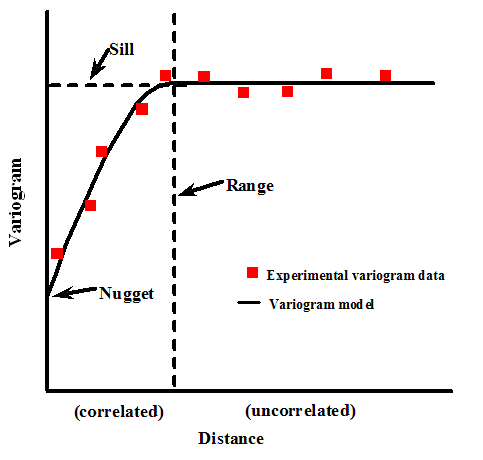
```

[Fonte do gráfico](https://vsp.pnnl.gov/help/Vsample/Kriging_Variogram_Model.htm)

📌 Alguns modelos mais usuais para o ajuste do variograma teorico:

```{r variograma-teorico, echo=FALSE, message=FALSE, warning=FALSE}
library(gstat)
library(ggplot2)
library(dplyr)

psill <- 80
range <- 12000
nugget <- 15
h <- seq(1, 20000, length.out = 200)

lin <- variogramLine(vgm(psill, "Lin", range, nugget), dist_vector = h) |> mutate(Modelo = "Linear")
exp <- variogramLine(vgm(psill, "Exp", range, nugget), dist_vector = h) |> mutate(Modelo = "Exponencial")
gau <- variogramLine(vgm(psill, "Gau", range, nugget), dist_vector = h) |> mutate(Modelo = "Gaussiano")
wav <- suppressWarnings(na.omit(variogramLine(vgm(psill, "Wav", range, nugget), dist_vector = h))) |> mutate(Modelo = "Wave")

p0 <- data.frame(dist = 0, gamma = nugget)
p0_list <- lapply(c("Linear", "Exponencial", "Gaussiano", "Wave"), \(m) cbind(p0, Modelo = m))

dados <- bind_rows(p0_list[[1]], p0_list[[2]], p0_list[[3]], p0_list[[4]],
                   lin, exp, gau, wav)

dados <- dados %>% filter(!is.na(gamma) & is.finite(gamma))

ggplot(dados, aes(x = dist, y = gamma, color = Modelo, linetype = Modelo)) +
  geom_line(size = 1.2) +
  labs(title = "Modelos Teóricos de Variograma",
       x = "Distância", y = "Semivariância") +
  theme_minimal(base_size = 14) +
  theme(
    legend.position = "bottom",
    legend.title = element_blank(),
    plot.title = element_text(face = "bold", hjust = 0.5),
    axis.line = element_line(color = "black"),
    panel.grid = element_line(color = "gray90"),
    panel.grid.minor = element_blank()
  )
```


📌 Parâmetros sugeridos para ajuste do variograma teórico:

Observando o Variograma Empírico, é possível sugerir os três parâmetros principais que definem a estrutura espacial dos dados:

| Parâmetro                  | Significado                                                                        | Interpretação visual no seu gráfico                                                                          |
| -------------------------- | ---------------------------------------------------------------------------------- | ------------------------------------------------------------------------------------------------------------ |
| **Nugget (efeito pepita)** | Variação a distância zero (ruído, erro de medição, microvariação)                  | O valor de semivariância onde o gráfico começa. Visualmente está entre **10 e 15**                           |
| **Range (alcance)**        | Distância onde a semivariância se estabiliza (pontos além disso são independentes) | A estabilização parece ocorrer por volta de **10.000 a 12.000 unidades de distância**                        |
| **Sill (platô)**           | Valor máximo da semivariância (nugget + psill)                                     | O platô está próximo de **80 a 100**, portanto o `psill` seria algo como **70 a 90** (psill = sill - nugget) |


```{r, echo=T}
## 1) Modelo Linear
lin.fit  = fit.variogram(variogram.emp, 
                         model = vgm(psill = 80, model = "Lin",
                                     range = 12000, nugget = 15))

## 2) Modelo exponencial
exp.fit  = fit.variogram(variogram.emp, 
                         model = vgm(psill = 80, model = "Exp",
                                     range = 12000, nugget = 15))

## 3) Modelo gaussiano
gau.fit  = fit.variogram(variogram.emp, 
                         model = vgm(psill = 80, model = "Gau",
                                     range = 12000, nugget = 15))

## 4) Modelo wave
wav.fit  = fit.variogram(variogram.emp, 
                         model = vgm(psill = 80, model = "Wav",
                                     range = 12000, nugget = 15))

```

::: box-dica2

Os comandos usam a função `fit.variogram()` do pacote `gstat` no R para ajustar modelos teóricos ao variograma empírico (representado pelo objeto `variogram.emp` da figura acima). Isso é essencial para modelar a dependência espacial entre os dados.

Os modelos ajustados foram: Modelo Linear (`Lin`), Exponencial (`Exp`), Gaussiano (`Gau`) e Wave (`Wav`). Para o ajuste dos mpdels, foram utilizados os seguintes parâmentros que definem a estrutura espacial dos dados:

- `model`: tipo de modelo teórico (forma da curva).

- `psill`: efeito de platô (sill parcial).

- `range`: alcance da dependência espacial.

- `nugget`: efeito pepita (variação não explicada, ruído ou erro de medição).

:::

```{r echo=FALSE, out.width="90%"}
# Layout: 2 linhas, 2 colunas
par(mfrow = c(2, 2))

# Plota cada modelo com linha vermelha
plot(variogram.emp, lin.fit, main = "Modelo Linear", col.line = "red")
plot(variogram.emp, exp.fit, main = "Modelo Exponencial", col.line = "red")
plot(variogram.emp, gau.fit, main = "Modelo Gaussiano", col.line = "red")
plot(variogram.emp, wav.fit, main = "Modelo Wave", col.line = "red")

# Restaura o layout padrão
par(mfrow = c(1, 1))
```


### 🧪 Validação Cruzada 

A validação cruzada é um processo utilizado para avaliar o desempenho do modelo de krigagem. No contexto espacial, ela consiste em retirar um ponto por vez da malha de dados, utilizar os demais pontos para prever o valor naquele local removido, comparar a previsão com o valor real observado e repetir esse procedimento para todos os pontos da amostra. Esse método permite estimar a capacidade do modelo em gerar boas predições em locais onde não há observações diretas.

🧮 O que é o **RMSE (Root Mean Squared Error)**: é um dos indicadores que resume a performance do modelo. É a "a raiz quadrática média" dos erros entre valores observados (reais) e predições (hipóteses).

$$\text{RMSE} = \sqrt{ \frac{1}{n} \sum_{i=1}^{n} (y_i - \hat{y}_i)^2 }$$

### Modelo Linear

```{r, echo=T}
## 1) Modelo Linear
cv.lin <- krige.cv(acumulado_24h ~x+y, locations = pluvio, model = lin.fit)
summary(cv.lin)
```

::: cox-dica2

- Executando a validação cruzada do modelo de krigagem linear (`lin.fit`) aplicado aos dados de precipitação `acumulado_24h` com base nas coordenadas `x` e `y`.

- `krige.cv()`: função do pacote `gstat` que realiza a validação cruzada.

- `locations = pluvio`, indica que os pontos estão no objeto espacial pluvio.

- Armazena o resultado (resíduos, predições, observações, etc.) no objeto `cv.lin`.

- `summary(cv.lin)`: Mostra estatísticas descritivas da predição (`var1.pred`), valor observado (`observed`) e resíduo (`residual`).
:::

```{r, echo=T}
plot(cv.lin$var1.pred ~ cv.lin$observed, cex = 1.2, lwd = 2)
abline(0, 1, col = "lightgrey", lwd = 2)
lm_lin <- lm(cv.lin$var1.pred ~ cv.lin$observed)
abline(lm_lin, col = "red", lwd = 2)
r2_lin = summary(lm_lin)$r.squared
rmse_lin = hydroGOF::rmse(cv.lin$var1.pred, cv.lin$observed)
```


::: cox-dica2

- Plota os valores preditos em função dos valores observados. Serve para visualizar a qualidade das previsões. 

- Ajusta um modelo linear entre predito e observado. Adiciona essa linha ao gráfico em vermelho, indicando o ajuste real das predições. Quanto mais próximos da linha cinza $45°$ <span style="color:#808080;">●</span>, melhor o modelo.

:::

### Modelo Exponencial

```{r, echo=T}
## 2) Modelo exponencial
cv.exp <- krige.cv(acumulado_24h ~x+y, locations = pluvio, model = exp.fit)
summary(cv.exp)
```

```{r, echo=T}
plot(cv.exp$var1.pred ~ cv.exp$observed, cex = 1.2, lwd = 2)
abline(0, 1, col = "lightgrey", lwd = 2)
lm_exp <- lm(cv.exp$var1.pred ~ cv.exp$observed)
abline(lm_exp, col = "red", lwd = 2)
r2_exp = summary(lm_exp)$r.squared
rmse_exp = hydroGOF::rmse(cv.exp$var1.pred, cv.exp$observed)

```

### Modelo Gaussiano


```{r, echo=T}
## 3) Modelo Gaussiano
cv.gau <- krige.cv(acumulado_24h ~x+y, locations = pluvio, model = gau.fit)
summary(cv.gau)

```


```{r, echo=T}
plot(cv.gau$var1.pred ~ cv.gau$observed, cex = 1.2, lwd = 2)
abline(0, 1, col = "lightgrey", lwd = 2)
lm_gau <- lm(cv.gau$var1.pred ~ cv.gau$observed)
abline(lm_gau, col = "red", lwd = 2)
r2_gau = summary(lm_gau)$r.squared
rmse_gau = hydroGOF::rmse(cv.gau$var1.pred, cv.gau$observed)

```

### Modelo Wave

```{r}
## 4) Modelo Wave
cv.wav <- krige.cv(acumulado_24h ~x+y, locations = pluvio, model = wav.fit)
summary(cv.wav)
```


```{r, echo=T}
plot(cv.wav$var1.pred ~ cv.wav$observed, cex = 1.2, lwd = 2)
abline(0, 1, col = "lightgrey", lwd = 2)
lm_wav <- lm(cv.wav$var1.pred ~ cv.wav$observed)
abline(lm_wav, col = "red", lwd = 2)
r2_wav = summary(lm_wav)$r.squared
rmse_wav = hydroGOF::rmse(cv.wav$var1.pred, cv.wav$observed)
```

### 📋 Tabela das estatística de $R^2$ e $RMSE$

```{r, echo=T}
# Criando um data frame com os nomes dos modelos
modelos <- c("Linear", "Exponencial", "Gaussiano", "Wave")

# Combinando os valores de R² e RMSE em um único data frame
tabela_desempenho <- data.frame(
  Modelo = modelos,
  R2 = c(r2_lin, r2_exp, r2_gau, r2_wav),
  RMSE = c(rmse_lin, rmse_exp, rmse_gau, rmse_wav)
)

# Visualizando a tabela
print(tabela_desempenho)

```

Apesar de todos os modelos apresentarem $R^2$ baixos (indicando que os modelos explicam uma parcela limitada da variabilidade dos dados), o modelo linear se destacou como o mais eficiente nesse conjunto de dados, tanto por explicar mais da variância da variável resposta (acumulado de chuva) quanto por apresentar o menor erro médio de previsão.


### Criando os grids do contorno da cidade do Rio de Janeiro para intermpolação

```{r, echo=T, message=FALSE, warning=FALSE, results='hide'}
# Importando o contorno do Rio
contorno.rio <- shapefile("dados/chuva_rio/MUNIC_2K_2022_IPP_SIRGAS.shp")

# Ou usar o comando

# contorno.rio <- st_geometry(read_municipality(code_muni = 3304557, year = 2022))
```

::: box-dica2

Criando um objeto com apenas o contorno do polígono da cidade do Rio de Janeiro.
:::

```{r, echo=T, echo=T, message=FALSE, warning=FALSE, results='hide'}
# Criando grade para interpolacao com a  resolucao de 50m
r <- raster(contorno.rio, res = 50)

# Criando um objeto formato raster
rp <- rasterize(contorno.rio, r, 0) 

# Trasnsformando o objeto raster no formato SpatialPixelsDataFrame
grid <- as(rp, "SpatialPixelsDataFrame") 
sp::plot(grid)
```

::: box-dica2

- Cria um objeto `RasterLayer` baseado no **contorno geográfico do Rio de Janeiro** (`contorno.rio`).

- `res = 50` define a **resolução da grade**: cada célula do raster terá **50 metros por 50 metros**.

- Esse raster ainda **não contém valores** — é só uma grade espacial com a extensão e projeção do contorno.

:::


### Krigagem

```{r, echo=T, echo=T, message=FALSE, warning=FALSE, results='hide'}
# Colocando os dados de chuva e o grid na mesma projecao
sp::proj4string(pluvio) = CRS(proj4string(contorno.rio))

# Executando a interpolação espacial por krigagem 
# usando diferentes modelos de variograma.
mapa_chuva_lin <- krige(acumulado_24h ~1, pluvio, grid, model =lin.fit)
mapa_chuva_exp <- krige(acumulado_24h ~1, pluvio, grid, model =exp.fit)
mapa_chuva_gau <- krige(acumulado_24h ~1, pluvio, grid, model =gau.fit)
mapa_chuva_wav <- krige(acumulado_24h ~1, pluvio, grid, model =wav.fit)
```


```{r, echo=T, out.width= "100%"}
plot.lin <- plot(mapa_chuva_lin, main = "Modelo Linear")
plot.exp <- plot(mapa_chuva_exp, main = "Modelo Exponencial")
plot.gau <- plot(mapa_chuva_gau, main = "Modelo Gaussiano")
plot.wav <- plot(mapa_chuva_wav, main = "Modelo Wave")

```

```{r, echo=T, out.width= "90%"}
###############################
# Outra opção de gerar o mapa:#
##############################

# Paleta personalizada: tons frios (azul/verde claro) para baixos, quente (vermelho) para altos
paleta_cor <- rev(viridis(100, option = "A"))  # opção "A" = magma (vermelho escuro a amarelo claro)

# Opções de paleta da função viridis():
# option = "A"  → magma     (preto → roxo → vermelho → laranja → amarelo claro)
# option = "B"  → inferno   (preto → vermelho → laranja → amarelo claro, com mais contraste)
# option = "C"  → plasma    (roxo → rosa → laranja → amarelo claro)
# option = "D"  → viridis   (verde escuro → azul → roxo → amarelo claro) [padrão]
# option = "E"  → cividis   (azul acinzentado → amarelo pálido, acessível para daltônicos)
# option = "F"  → rocket    (roxo escuro → rosa → branco amarelado)
# option = "G"  → mako      (azul escuro → ciano → verde-água, tons frios)
# option = "H"  → turbo     (azul → verde → amarelo → laranja → vermelho, vibrante estilo Google)


# Plots com a nova paleta
spplot(mapa_chuva_lin, "var1.pred", main = "Modelo Linear", col.regions = paleta_cor)
spplot(mapa_chuva_exp, "var1.pred", main = "Modelo Exponencial", col.regions = paleta_cor)
spplot(mapa_chuva_gau, "var1.pred", main = "Modelo Gaussiano", col.regions = paleta_cor)
spplot(mapa_chuva_wav, "var1.pred", main = "Modelo Wave", col.regions = paleta_cor)
```


### 🔧 Auto Krige 

A função `autoKrige()` do pacote `automap` é utilizada para realizar a krigagem de forma automatizada, combinando os passos de ajuste do variograma e interpolação espacial em um único processo. Ela permite que o usuário defina uma variável de interesse e as coordenadas espaciais associadas, e então calcula o variograma experimental, ajusta automaticamente (ou conforme especificado) um modelo teórico de variograma — como exponencial, gaussiano ou esférico — e executa a krigagem ordinária sobre uma grade de predição. O resultado é um objeto que contém os valores interpolados, a variância da predição e os parâmetros do modelo ajustado, o que facilita a geração de mapas e a análise espacial de forma prática e eficiente, mesmo para usuários com pouca familiaridade com o ajuste manual de variogramas.

```{r, echo=T, message=FALSE, warning=FALSE}
# Modelando
auto.krige = autoKrige(acumulado_24h~x+y, pluvio, grid, model = 'Exp')
summary(auto.krige)
```

::: box-dica2

- `acumulado_24h ~ x + y`: fórmula indicando que será feito um modelo espacial com base nas coordenadas x e y para a variável de interesse acumulado_24h (precipitação).

- `pluvio`: dados observados de precipitação (classe SpatialPointsDataFrame).

- `grid`: grade de predição (onde queremos estimar os valores).

- `modelmodel = "Exp"`: especifica o tipo de modelo de variograma a ser ajustado — neste caso, exponencial.
:::

```{r, echo=T, message=FALSE, warning=FALSE}
# Validação cruzada
auto.krige.cv <- autoKrige.cv(acumulado_24h~x+y, pluvio, model = 'Exp')
summary(auto.krige.cv)
```

### Convertendo para o formato raster - auto krige

```{r, echo=T, echo=T, message=FALSE, warning=FALSE}
raster_chuva <- raster(auto.krige$krige_output)
plot(raster_chuva)
```
```{r, echo=T, echo=T, message=FALSE, warning=FALSE}
# Outra opção de plotar o raster
sp::spplot(auto.krige$krige_output, "var1.pred", main = "AutoKrige - Modelo Exponencial")

```

- Caso queira salvar a imagem raster em um arquivo formato geotiff para ler em algum SIG por exemplo:
  
```{r, echo=T, message=FALSE, warning=FALSE}
# Exportando o objeto da imagem
writeRaster(raster_chuva,
            filename = 'dados/chuva_rio/chuva_auto.tiff',
            format = 'GTiff',
            overwrite = T)

# Importando de volta para o R
raster_chuva <- raster("dados/chuva_rio/chuva_auto.tiff")
```

### 🔍 Fazendo o mapa interativo com as estações

```{r, echo=T, message=FALSE, warning=FALSE}
# 1. Importando e transformando as estações pluviométricas
estacoes.sf <- read_sf("dados/chuva_rio/Estac_C3_B5es_Alerta_Rio.shp")
estacoes.longlat <- st_transform(estacoes.sf, 4326)  # EPSG:4326 = WGS84
estacoes.longlat$coords <- st_coordinates(estacoes.longlat)
estacoes.longlat$X <- estacoes.longlat$coords[, 1]
estacoes.longlat$Y <- estacoes.longlat$coords[, 2]
```

```{r, echo=T, message=FALSE, warning=FALSE}
# 2. Importando e transformando a malha de bairros
bairros.sf <- read_sf("dados/chuva_rio/BAIRROS_2K_2022_IPP_SIRGAS.shp")
bairros.longlat <- st_transform(bairros.sf, 4326)
bairros.longlat <- st_make_valid(bairros.longlat)  # Corrige geometrias se necessário
```


```{r, echo=T, message=FALSE, warning=FALSE}
# 3. Convertendo o resultado da krigagem para raster
raster_chuva <- raster(auto.krige$krige_output["var1.pred"])

# 4. Projetando o raster para WGS84
raster_chuva_longlat <- projectRaster(raster_chuva, crs = CRS("+proj=longlat +datum=WGS84"))
```


```{r, echo=T, message=FALSE, warning=FALSE, results='hide'}
# 5. Definindo a paleta de cores da superfície interpolada
pal <- colorNumeric(
  palette = c("#000066", "#00c8f8", "#F0E68C", "#FFFF00", "#FF8C00"),
  domain = values(raster_chuva_longlat),
  na.color = "transparent",
  reverse = TRUE
)
```

```{r, echo=T, message=FALSE, warning=FALSE, out.width= "100%"}
# 6. Construindo o mapa interativo
leaflet(data = estacoes.longlat, options = leafletOptions(attributionControl = FALSE)) |>
  addProviderTiles("CartoDB.Positron", group = "Ruas") |>
  addProviderTiles("Esri.WorldImagery", options = providerTileOptions(opacity = 0.7), group = "Satélite") |>
  addProviderTiles("CartoDB.Voyager", group = "Voyager") |>
  setView(lng = -43.42, lat = -22.90, zoom = 10.4) |>
  # Adicionando os marcadores das estações
  addMarkers(~X, ~Y, popup = ~as.character(est), label = ~as.character(est), group = "Estações") |>
  # Adicionando a malha de bairros
  addPolygons(data = bairros.longlat,
              weight = 3,
              color = "darkblue",
              smoothFactor = 1,
              fill = FALSE,
              labelOptions = labelOptions(
                style = list("font-weight" = "normal", padding = "3px 8px"),
                textsize = "13px",
                direction = "auto"),
              group = "Bairros") |>
  # Adicionando o raster de chuva interpolada
  addRasterImage(raster_chuva_longlat, colors = pal, opacity = 0.8, group = "Chuva: 1 semana") |>
  # Legenda
  addLegend(pal = pal, values = values(raster_chuva_longlat),
            title = "Chuva Acumulada - 1 semana",
            group = "Chuva: 1 semana") |>
  # Controle das camadas
  addLayersControl(
    baseGroups = c("Voyager", "Ruas", "Satélite"),
    overlayGroups = c("Estações", "Bairros", "Chuva: 1 semana"),
    options = layersControlOptions(collapsed = FALSE),
    position = "bottomleft") |>
  # Oculta os bairros inicialmente
  hideGroup(group = c("Bairros"))
```


# Bibliografia sugerida

* Applied Spatial Statistics for Public Health Data; Lance A. Waller, Carol A. Gotway Wiley-Interscience 1St ed. 2004

* Applied Spatial Data Analysis with R; Roger S. Bivand, Edzer Pebesma , Virgilio Gomez-Rubio Springer; Edição: 2nd ed. 2013

* Cressie, N. (1993). Statistics for Spatial Data (Revised edition). New York: Wiley.

* Druck, S.; Carvalho, M.S.; Câmara, G.; Monteiro, A.V.M. (eds). [Análise Espacial de Dados Geográficos](http://www.dpi.inpe.br/gilberto/livro/analise/). Brasília, EMBRAPA, 2004.

* Fotheringham, A. S., Brunsdon, C., & Charlton, M. (2002). Geographically Weighted Regression: The Analysis of Spatially Varying Relationships. Wiley.

* Geocomputation with R by Robin Lovelace, Jakub Nowosad and Jannes Muenchow. [Geocomputation with R](https://geocompr.robinlovelace.net/), 2021.

* GeoComputation and Spatial Analysis practicals by Lex Comber
[On-line Book](https://bookdown.org/lexcomber/GEOG3195/)

* GEOG5917 Big Data & Consumer Analytics - RStudio Practicals by Lex Comber
[On-line Book](https://bookdown.org/lexcomber/GEOG5917/)

* Interactive Spatial Data Analysis by Trevor C. Bailey , Anthony C. Gatrell Routledge, 1995

* Spatial Statistics Workbook of Department of Criminology at the University of Manchester by Reka Solymosi and Juanjo Medina [Crime Mapping in R](https://maczokni.github.io/crime_mapping_textbook/)

* Spatial Data Science with R
[Spatial Data Science with R](https://rspatial.org/raster/index.html)


